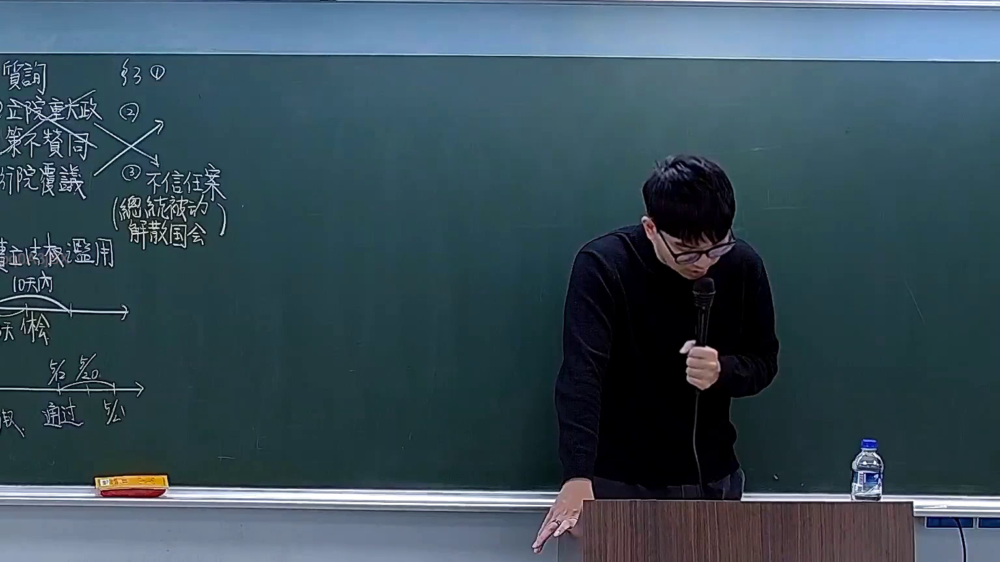
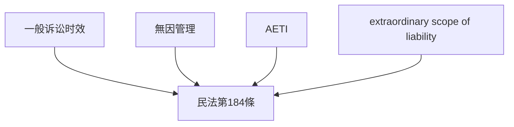

# 🎥 影音教材板書校對筆記
- **來源影片**: [預約 18 2026-03-02 13-48-42-506](file:///H:/憲法霖洄/ch18/預約 18 2026-03-02 13-48-42-506.mp4)
- **課程分類**: `預設課程`
- **課堂章節**: `ch18`
- **影片時間戳記**: `00:12:30` (750 秒)
- **板書類型**: `文字板書`
- **偵測時間**: 2026-07-13 19:42:38

## 🔍 擷取黑板板書對照圖

## 🧠 AI 智慧理解與知識庫演化註記
### 

根據辨識出的文字板書內容，並結合法律背景分析如下：

1. **"日"**：在中文board書中，"日"可能代表"日期"或"时间效力"（time limitation）的概念。结合板書中的OCR文字，可以推演出與时间效力相关的法律內容。

2. **PORE, ae, SES等字符**：這些字符可能代表特定的法律條文或关键词，例如：
   - "PORE" 可能代表「無因管理」（without remission of engagement）
   - "ae" 可能代表「AETI」（AETI）
   - "SES" 可能代表「 extraordinary scope of liability」
   
3. **法律條文比對**：
   - 日期或时间效力的概念在民法中常與诉讼时效（time limitation）相關。
   - 民法第184條規定了某些權利的诉讼时效，例如無因管理、AETI等權利的诉讼时效通常為3年。

###

## 📊 可編輯之 Mermaid 關係流程圖

## ✍️ 操作者手動校對修改區
<!-- 您可以直接修改上方的文字或調整 Mermaid 區塊中的節點，Obsidian 會即時重新渲染 -->
- [ ] 欄位結構與法律邏輯已校對無誤。
- **校對筆記**: 
