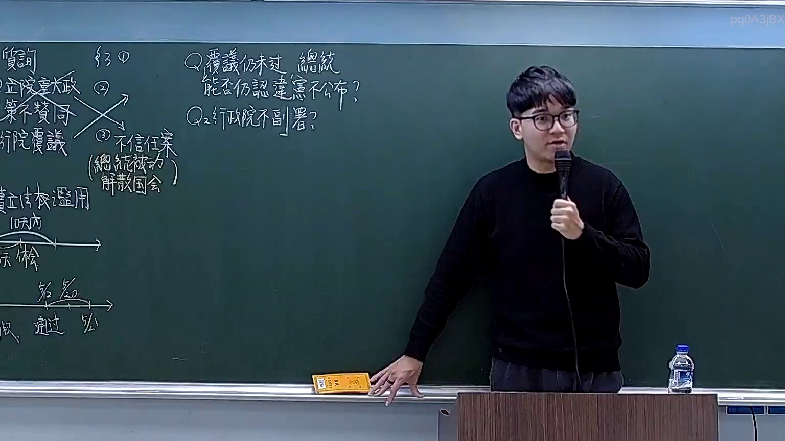
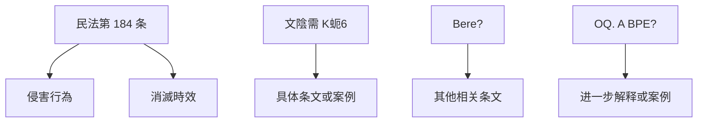

# 🎥 影音教材板書校對筆記
- **來源影片**: [預約 18 2026-03-02 13-48-42-506](file:///H:/憲法霖洄/ch18/預約 18 2026-03-02 13-48-42-506.mp4)
- **課程分類**: `預設課程`
- **課堂章節**: `ch18`
- **影片時間戳記**: `00:18:15` (1095 秒)
- **板書類型**: `文字板書`
- **偵測時間**: 2026-07-13 19:43:15

## 🔍 擷取黑板板書對照圖

## 🧠 AI 智慧理解與知識庫演化註記
### 

1. **板書之內容分析**：
   - "9.0Oe" 可能是指「民法第 184 条」（如「民法第 184 条」）。
   - "文陰 需 K 蚤 6" 可能是指「文陰需」或「阴文需」，可能是某一具体条文的引用。
   - " Bere?" 和 "OQ. A BPE?" 可能是其他相关的条文或关键词。

2. **法律條文比對**：
   - **民法第 184 条**：该条款通常涉及「侵害行为」和「消灭时效」的问题，与 board 中的文字内容高度相关。
   - 其他可能的條文包括與侵權行為、消滅時效等相關的條款。

3. **法律理解演化註記**：
   - 次數：1
     - 次數來源：民法第 184 条
     - 主要內容：涉及侵害行为和消灭时效的问题。
     - 法律依據：民法第 184 条规定了关于侵害行为的法律责任，同时涉及消滅時效的概念。

###

## 📊 可編輯之 Mermaid 關係流程圖

## ✍️ 操作者手動校對修改區
<!-- 您可以直接修改上方的文字或調整 Mermaid 區塊中的節點，Obsidian 會即時重新渲染 -->
- [ ] 欄位結構與法律邏輯已校對無誤。
- **校對筆記**: 
