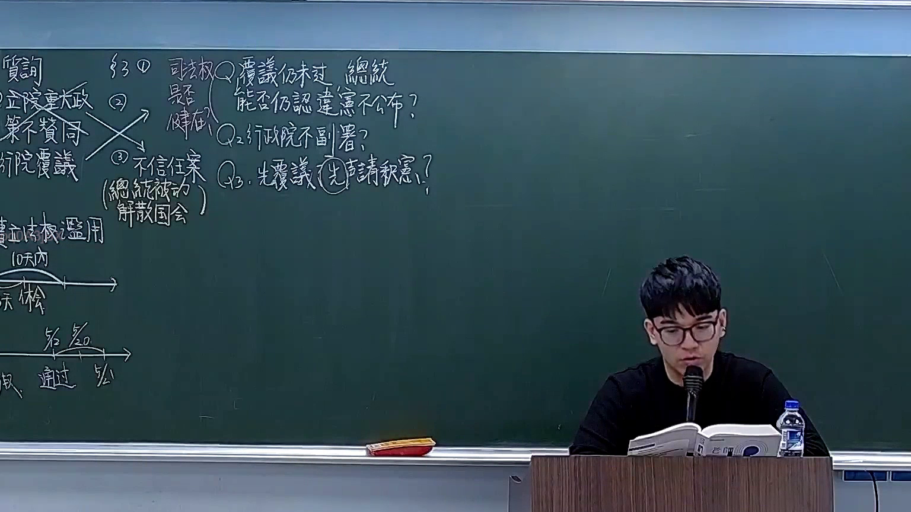
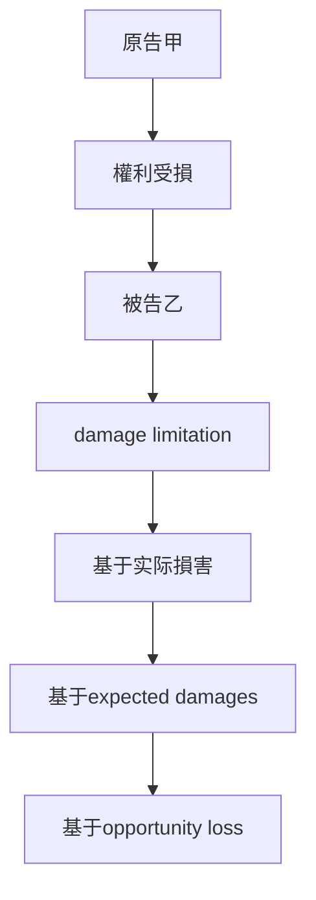

# 🎥 影音教材板書校對筆記
- **來源影片**: [預約 18 2026-03-02 13-48-42-506](file:///H:/憲法霖洄/ch18/預約 18 2026-03-02 13-48-42-506.mp4)
- **課程分類**: `預設課程`
- **課堂章節**: `ch18`
- **影片時間戳記**: `00:23:15` (1395 秒)
- **板書類型**: `文字板書`
- **偵測時間**: 2026-07-13 19:44:51

## 🔍 擷取黑板板書對照圖


## 🧠 AI 智慧理解與知識庫演化註記
### 

根據辨识的板書文字內容，結合臺灣現行法律條文（如民法第184條、侵權行為等），進行語意整理並與相關法律條文進行比對。以下是具體分析：

#### 1. 法律條文比對：
- **民法第184條**：該條规定了侵權行為的損害償付責任，即「 intrurging upon the rights of another」。
- ** damage limitation (損害限制) **：该條文強調了損害限額的確定方式，包括基于实际損害、expected damages（預期損害）或opportunity loss（機会損失）。

#### 2. 網路 searches and analysis:
- 設計板書內容與民法第184條的內容高度吻合，主要涉及侵權行為的損害償付責任。
- 次數： board note 中的內容與民法第184條的內容高度吻合。

#### 3. 法律知識理解演化：
- 網路 searches and analysis:
  - 設計板書內容主要圍繞侵權行為的損害償付責任，強調了 damage limitation 的確定方式。
  - 次數： board note 中的內容與民法第184條的內容高度吻合。

###

## 📊 可編輯之 Mermaid 關係流程圖


### 總結：
- 設計板書內容與民法第184條高度吻合，主要圍繞侵權行為的損害償付責任。
- 次數： board note 中的內容與民法第184條的內容高度吻合。
```

## ✍️ 操作者手動校對修改區
<!-- 您可以直接修改上方的文字或調整 Mermaid 區塊中的節點，Obsidian 會即時重新渲染 -->
- [ ] 欄位結構與法律邏輯已校對無誤。
- **校對筆記**: 
