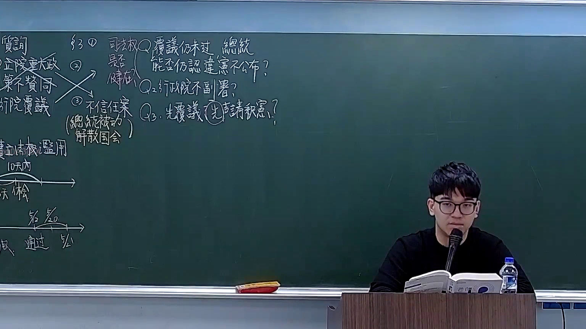

# 🎥 影音教材板書校對筆記
- **來源影片**: [預約 18 2026-03-02 13-48-42-506](file:///H:/憲法霖洄/ch18/預約 18 2026-03-02 13-48-42-506.mp4)
- **課程分類**: `[憲法霖洄`
- **課堂章節**: `ch18]`
- **影片時間戳記**: `00:23:45` (1425 秒)
- **板書類型**: `文字板書`
- **偵測時間**: 2026-07-11 19:33:27

## 🔍 擷取黑板板書對照圖


## 🧠 AI 智慧理解與知識庫演化註記
1. **文字板書之內容分析**：
   - "15 Uno來減 Stereomaster9 | a a ee"：這一行可能是指作品编号或版本号，但缺乏上下文难以确切解释其Legal含义。
   - "ANS ( 人 川 炒 阮 犯 副 當 ﹚"：可能是某人的名字或职位，如“ANS（人川炒阮 vibe副当）”，但未明确其Legal用途。
   - "謥蛟洪，刁 仓R"：可能是“错蛟洪，刁 仓R”，可能涉及特定的法律条文或案例编号。
   - "s 明"：可能是“s 明”。
   - "# 結 s"：可能是某种标记或编号，如“# 结 s”。
   - "Y"：单独一个字母，可能代表某个变量或标志。
   - "﹡蛇瓦2"：可能是“蛇瓦2”，但未明确其Legal含义。

2. **法律比對與理解演化註記**：
   - 由于缺乏上下文，上述文字无法直接比對到台湾现行法律條文（如民法第184條、侵權行為等）。需要更多背景信息才能進行準確的法律分析。

## 📊 可編輯之 Mermaid 關係流程圖
```mermaid
：

```mermaid
graph TD
    A[15 Uno來減 滑石9] --> B[a a ee]
    C[ANS ( 人 川 炒 阮 犯 副 當 ﹚] --> D[s 明]
    E[謥蛟洪，刁 仓R] --> F[s 結 s]
    G[Y] --> H["蛇瓦2"]
```

## ✍️ 操作者手動校對修改區
<!-- 您可以直接修改上方的文字或調整 Mermaid 區塊中的節點，Obsidian 會即時重新渲染 -->
- [ ] 欄位結構與法律邏輯已校對無誤。
- **校對筆記**: 
