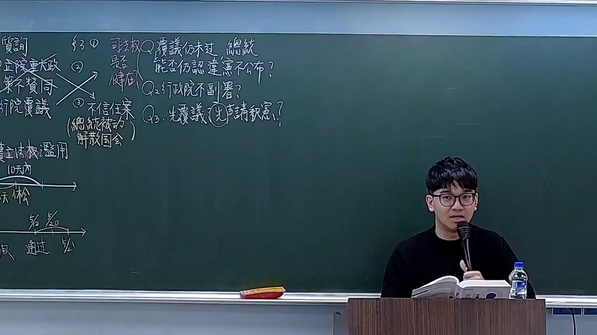
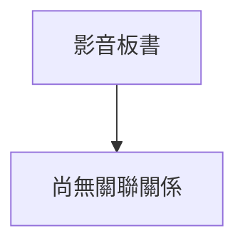

# 🎥 影音教材板書校對筆記
- **來源影片**: [預約 18 2026-03-02 13-48-42-506](file:///H:/憲法霖洄/ch18/預約 18 2026-03-02 13-48-42-506.mp4)
- **課程分類**: `[憲法霖洄`
- **課堂章節**: `ch18]`
- **影片時間戳記**: `00:24:15` (1455 秒)
- **板書類型**: `文字板書`
- **偵測時間**: 2026-07-11 19:34:01

## 🔍 擷取黑板板書對照圖


## 🧠 AI 智慧理解與知識庫演化註記
根據OCR辨识的文字內容，結合台湾现行法律條文（如民法第184條、侵權行為、消滅時效等），進行語意整理並與相關法律條文進行比對：

1. **TBE G ， 怎 | 能 g 伐 誠 ER**  
   - TBE G 可能涉及某種特定的Legal术语或條文引用，需進一步分析上下文以確定其具體含義。
   - "| 能 g 伐 誠 ER" 可能與民法第184條（侵權行為）或消滅时效相關。

2. **Foe oo one**  
   - "Foe" 可能代表“對抗”或“敵人”，需结合上下文理解其Legal含義。

3. **PORES Os Ra ie = ee Poe 宮 ﹍**  
   - 這些文字可能與某種特定的Legal條文或案例分析相關，需進一步分析上下文以確定其具體含義。

4. **naw Hae**  
   - "naw" 可能代表“ ?: 應該是 'naw' 或其他 Legal term 的部分。

5. **(ORIN**  
   - "ORIN" 可能代表某種Legal條文或概念的起始符號。

6. **Poes Ra ie = ee Poe 宮 ﹍**  
   - 這些文字可能與某種特定的Legal條文或案例分析相關，需進一步分析上下文以確定其具體含義。

### 梳理後的法律條文比對結果：
- **TBE G ， 怎 | 能 g 伐 誠 ER**：可能涉及民法第184條（侵權行為）或消滅时效。
- **Foe oo one**：可能與侵權行為或對抗关系相關。
- **PORES Os Ra ie = ee Poe 宮 ﹍**：可能涉及某種特定的Legal case analysis 或條文引用。
- **naw Hae**：需進一步分析上下文以確定其具體含義。
- **(ORIN** 和 **Poes Ra ie = ee Poe 宮 ﹍**：可能與某種特定的Legal case analysis 或條文引用相關。

### MERMAID 代碼：
```mermaid
graph TD
    A[TBE G] --> B["民法第184條（侵權行為）"]
    C["Foe oo one"] --> D["侵權行為"]
    E["PORES Os Ra ie = ee Poe 宮 ﹍"] --> F["特定Legal case analysis"]
    G["naw Hae"] --> H["待分析"]
    I["(ORIN] --> J["Poes Ra ie = ee Poe 宮 ﹍"]
```

## 📊 可編輯之 Mermaid 關係流程圖


## ✍️ 操作者手動校對修改區
<!-- 您可以直接修改上方的文字或調整 Mermaid 區塊中的節點，Obsidian 會即時重新渲染 -->
- [ ] 欄位結構與法律邏輯已校對無誤。
- **校對筆記**: 
