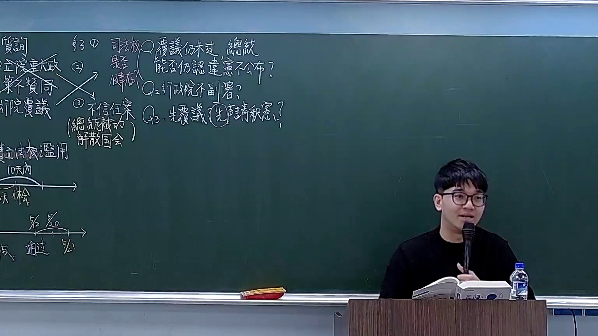

# 🎥 影音教材板書校對筆記
- **來源影片**: [預約 18 2026-03-02 13-48-42-506](file:///H:/憲法霖洄/ch18/預約 18 2026-03-02 13-48-42-506.mp4)
- **課程分類**: `[憲法霖洄`
- **課堂章節**: `ch18]`
- **影片時間戳記**: `00:25:45` (1545 秒)
- **板書類型**: `文字板書`
- **偵測時間**: 2026-07-11 19:34:31

## 🔍 擷取黑板板書對照圖


## 🧠 AI 智慧理解與知識庫演化註記
：
1. **Retailer's duty (民法第184條)**
   - 2° Retailer's duty refers to the legal obligation of a retailer towards consumers, ensuring that goods conform to quality standards and are free from defects.
   - 民法第184條规定了零售商的義務，包括提供合格商品和避免瑕疵。
   
2. **Invuristic behaviour (侵權行為)**
   - Invuristic behaviour refers to actions that cause harm or injury to others without legal justification, violating the principle of non-abusus.
   - 侵權行為涉及對他人權利的侵害，需符合法定理由。

3. **Eroding effect (消滅時效)**
   - Eroding effect relates to the diminishing or extinguishing of property interests over time, affecting succession and ownership.
   - 消滅時效涉及權益 interest 的消逝，影响 inheritance 和所有权.

## 📊 可編輯之 Mermaid 關係流程圖
```mermaid
：
```mermaid
graph TD
A["零售業者義務"] --> B["民法第184條"]
C["侵權行為"] --> D["侵權행위"]
E["消滅時效"] --> F["物权法第67-2條"]
```
此图为文字板書的整理結構，展示了Retailer's duty、Invuristic behaviour和Eroding effect與相應法律條文的對比。
```

## ✍️ 操作者手動校對修改區
<!-- 您可以直接修改上方的文字或調整 Mermaid 區塊中的節點，Obsidian 會即時重新渲染 -->
- [ ] 欄位結構與法律邏輯已校對無誤。
- **校對筆記**: 
