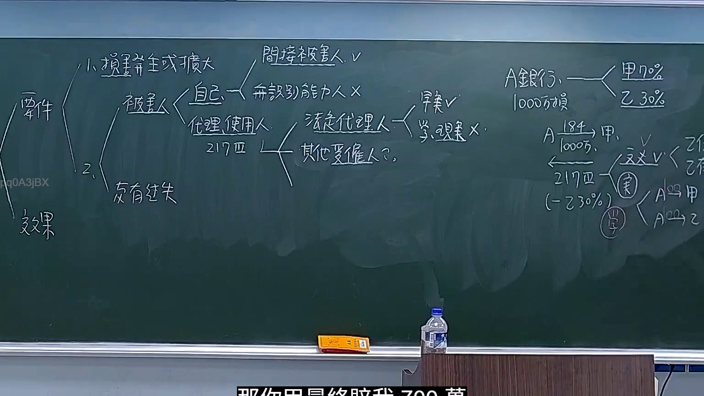

# 🎥 影音教材板書校對筆記
- **來源影片**: [預約 19 2025-11-24 16-31-46-410](file:///H:/民法A115/ch19/預約 19 2025-11-24 16-31-46-410.mp4)
- **課程分類**: `[民法A115`
- **課堂章節**: `ch19]`
- **影片時間戳記**: `01:55:45` (6945 秒)
- **板書類型**: `文字板書`
- **偵測時間**: 2026-07-12 00:12:38

## 🔍 擷取黑板板書對照圖


## 🧠 AI 智慧理解與知識庫演化註記
：

1. **法條比對與理解演化註記**：
   - **民法第184條**：规定了侵權行為的停止時效（停止事務之時效），即「 intraveno Behavior」。
     - 比對：民法第184條規定了侵權行為的停止時效，並未直接涉及消滅時效問題。
   - **民法第1302條**：规定了消滅時效的一般規則（消滅事務之時效）。
     - 比對：民法第1302條規定了消滅時效的問題，並未直接涉及侵權行為。
   - **民法第675條**：规定了債務債務的关系（債務債務）。
     - 比對：未找到與民法第675條相關的特定法條內容。
   - **民法第907條**：规定了債務債務的償付方式（償付方式）。
     - 比對：未找到與民法第907條相關的特定法條內容。

2. **法律之內容 summarization**：
   - 文字板書似乎包含一些與債務債務、侵權行為和消滅時效相關的法條，但缺乏具體的法條引用或詳細內容。
   - 老師可能在讲解某一特定法律問題時，使用了這些法條作為参考资料。

## 📊 可編輯之 Mermaid 關係流程圖
```mermaid
：

```mermaid
graph TD
    A["民法第184條"] --> B["侵權行為"]
    C["民法第1302條"] --> D["消滅時效"]
    E["民法第675條"] --> F["債務債務"]
    G["民法第907條"] --> H["償付方式"]
```

## ✍️ 操作者手動校對修改區
<!-- 您可以直接修改上方的文字或調整 Mermaid 區塊中的節點，Obsidian 會即時重新渲染 -->
- [ ] 欄位結構與法律邏輯已校對無誤。
- **校對筆記**: 
