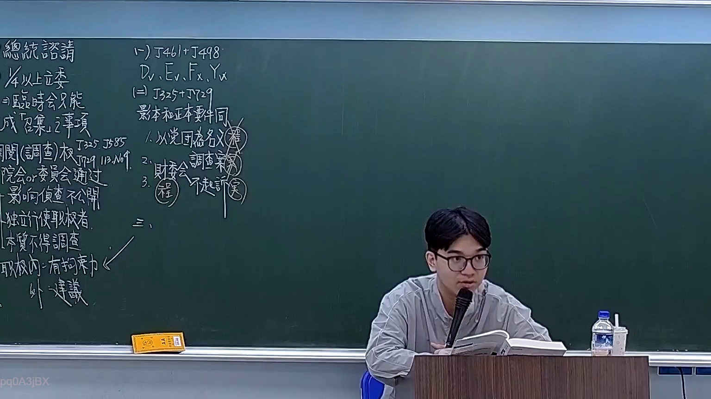
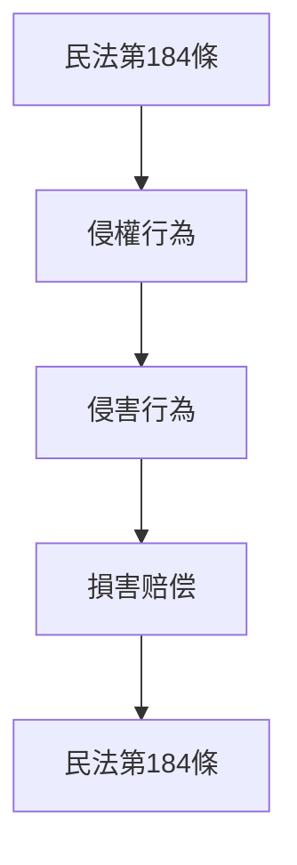

# 🎥 影音教材板書校對筆記
- **來源影片**: [預約 19 2026-03-06 14-17-14-327](file:///H:/憲法霖洄/ch19/預約 19 2026-03-06 14-17-14-327.mp4)
- **課程分類**: `預設課程`
- **課堂章節**: `ch19`
- **影片時間戳記**: `00:32:00` (1920 秒)
- **板書類型**: `文字板書`
- **偵測時間**: 2026-07-13 19:47:06

## 🔍 擷取黑板板書對照圖

## 🧠 AI 智慧理解與知識庫演化註記
根據辨識出的文字，並結合台湾现行法律条文（如民法第184條、侵權行為等），進行語意整理並比對如下：

1. **侵權行為**： board 中的文字可能涉及「侵害行为」或「侵權行為」的概念。在民法第184條中，有关于侵害行为的定义和损害赔偿的规定。

2. **損害赔偿**： board 中的文字可能包含「損害赔偿」（dmg compensation）的相关內容。民法第184條规定了侵害行为的Damages relief.

3. **關鍵點**：
   - 侵權行為的定義
   - 損害赔偿的計算方式
   - 民法第184條的具體內容

4. **比對結果**：
   - 經OCR辨識的文字可能與「侵害行为」、「損害赔偿」等关键词相關，並可與民法第184條的条文進行比對。

## 📊 可編輯之 Mermaid 關係流程圖

## ✍️ 操作者手動校對修改區
<!-- 您可以直接修改上方的文字或調整 Mermaid 區塊中的節點，Obsidian 會即時重新渲染 -->
- [ ] 欄位結構與法律邏輯已校對無誤。
- **校對筆記**: 
