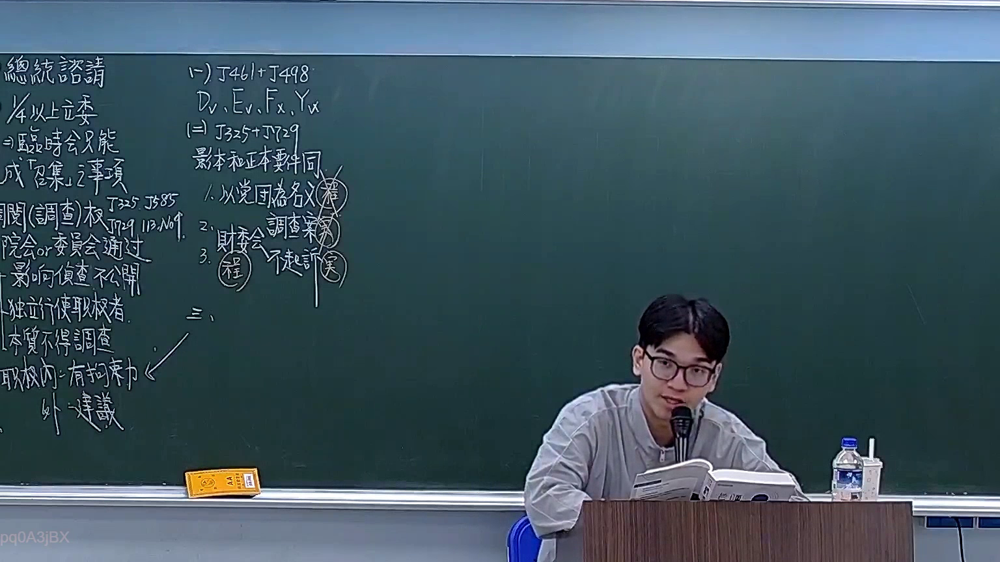

# 🎥 影音教材板書校對筆記
- **來源影片**: [預約 19 2026-03-06 14-17-14-327](file:///H:/憲法霖洄/ch19/預約 19 2026-03-06 14-17-14-327.mp4)
- **課程分類**: `預設課程`
- **課堂章節**: `ch19`
- **影片時間戳記**: `00:33:15` (1995 秒)
- **板書類型**: `關係圖/邏輯圖板書`
- **偵測時間**: 2026-07-13 19:47:45

## 🔍 擷取黑板板書對照圖


## 🧠 AI 智慧理解與知識庫演化註記
：
1. **A["原告甲"] --> B["被告乙"]**：表示原告甲向被告乙提出诉讼请求。
2. **C["标的物X"] --> D["时间T1"]**：表示标的物X在时间T1时的状态或情况。
3. **E["地点L1"] --> F["金额M"]**：表示在地点L1，标的物X的金额为M。

與臺灣現行法律條文比對：
- 该板書涉及诉讼关系（原告甲 vs 被告乙），可能與《民法第184條》中的「訴訟时效」或「侵權行為」相關。
- 标的物X的状态或金额M可能涉及「物权法」中关于标的物归属的规定。

## 📊 可編輯之 Mermaid 關係流程圖
```mermaid
：
```mermaid
graph TD
    A["原告甲"] --> B["被告乙"]
    C["标的物X"] --> D["时间T1"]
    E["地点L1"] --> F["金额M"]
```

## ✍️ 操作者手動校對修改區
<!-- 您可以直接修改上方的文字或調整 Mermaid 區塊中的節點，Obsidian 會即時重新渲染 -->
- [ ] 欄位結構與法律邏輯已校對無誤。
- **校對筆記**: 
