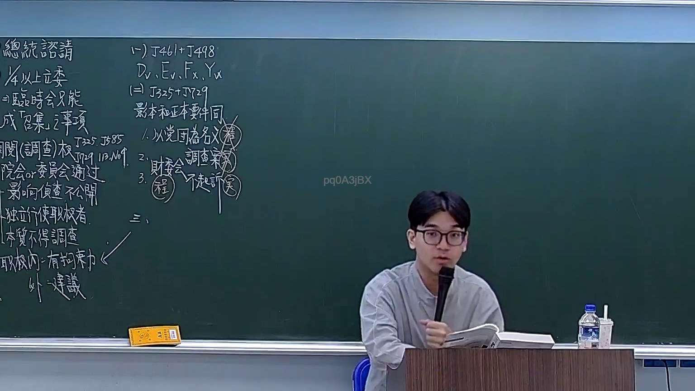
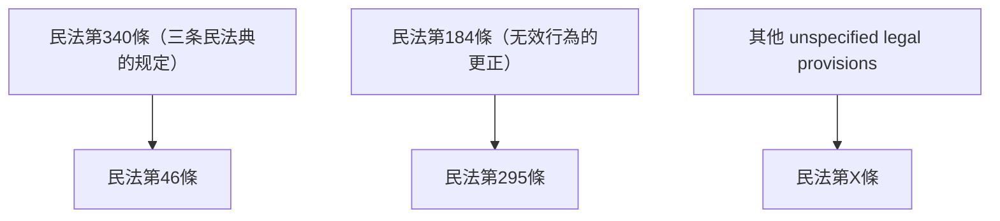

# 🎥 影音教材板書校對筆記
- **來源影片**: [預約 19 2026-03-06 14-17-14-327](file:///H:/憲法霖洄/ch19/預約 19 2026-03-06 14-17-14-327.mp4)
- **課程分類**: `預設課程`
- **課堂章節**: `ch19`
- **影片時間戳記**: `00:35:45` (2145 秒)
- **板書類型**: `文字板書`
- **偵測時間**: 2026-07-13 19:49:37

## 🔍 擷取黑板板書對照圖

## 🧠 AI 智慧理解與知識庫演化註記
1. **T46|﹚1448**：這可能是指民法第46條（T46），有关继承顺序和时间效力的规定。

2. **bee 3 men’s will**：這涉及到民法第340條，关于三民Will的效力，即「三条民法典的规定」。

3. **更正无效行为**：這涉及到民法第184條，关于无效行为的更正。

4. **帕斯卡法则（Pascal's rule）**：這可能是指民法中的某种特定规定或原则，但需进一步确认其具体条文。

5. **295 / 炎 LANG)**：這可能是指民法第295條，关于时间效力的特别规定。

6. **YANG 2 pd0ASjBX**：這可能涉及某个特定的条文或概念，但需进一步确认其具体条文。

7. **Sophie & ARTE =**：這可能是某种特定的法律术语或条文，但需进一步确认其具体条文。

8. **更正无效行为**：這涉及到民法第184條，关于无效行为的更正。

## 📊 可編輯之 Mermaid 關係流程圖

## ✍️ 操作者手動校對修改區
<!-- 您可以直接修改上方的文字或調整 Mermaid 區塊中的節點，Obsidian 會即時重新渲染 -->
- [ ] 欄位結構與法律邏輯已校對無誤。
- **校對筆記**: 
