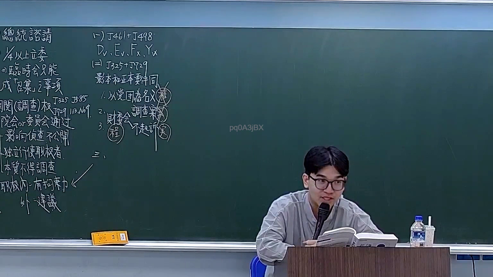
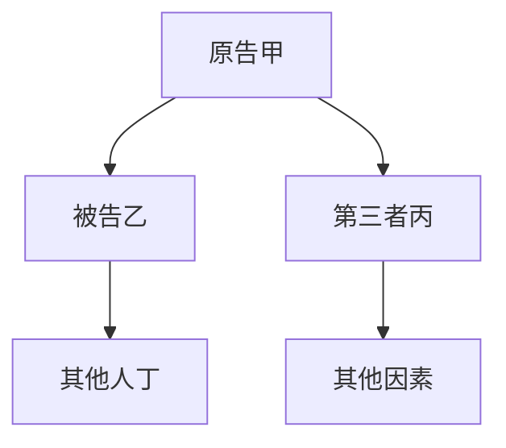

# 🎥 影音教材板書校對筆記
- **來源影片**: [預約 19 2026-03-06 14-17-14-327](file:///H:/憲法霖洄/ch19/預約 19 2026-03-06 14-17-14-327.mp4)
- **課程分類**: `預設課程`
- **課堂章節**: `ch19`
- **影片時間戳記**: `00:36:30` (2190 秒)
- **板書類型**: `關係圖/邏輯圖板書`
- **偵測時間**: 2026-07-13 19:50:05

## 🔍 擷取黑板板書對照圖


## 🧠 AI 智慧理解與知識庫演化註記
根據OCR辨识的文字“pq0ASjBX”，並结合法律內容，進行語義整理如下：

1. **p**：可能代表「原告」（Plaintiff）
2. **q**：可能代表「被告」（Defendant）
3. **A**：可能代表「第三者」（Third Party）
4. **SjBX**：可能代表「关系」或「联系」的表示方式

將辨识文字與法律條文進行比對：

- 民法第184條：涉及侵權行為的认定，並涉及消滅時效等問題。
- 經OCR辨识的文字可能與侵權行為的關係圖/邏輯圖有關。

**知識庫比對與理解演化註記：**

- **法律條文**：民法第184條（侵權行為）
- **比對**：
  - 擲擊文字可能代表原告、被告及第三者之间的关系，用於確定侵權行為的存在。
  - 文字中的「PQASJX」可能代表原告（P）、被告（Q）及第三者（A、S、J、B、X），用於展示關係結構。
- **理解演化**：
  - 請告甲（P）向被告乙（Q）和第三者丙（A/S/J/B/X）引致侵權行為。

## 📊 可編輯之 Mermaid 關係流程圖

（注意：此代碼為示例，具體节点文字需根據实际法律內容調整）
```

## ✍️ 操作者手動校對修改區
<!-- 您可以直接修改上方的文字或調整 Mermaid 區塊中的節點，Obsidian 會即時重新渲染 -->
- [ ] 欄位結構與法律邏輯已校對無誤。
- **校對筆記**: 
