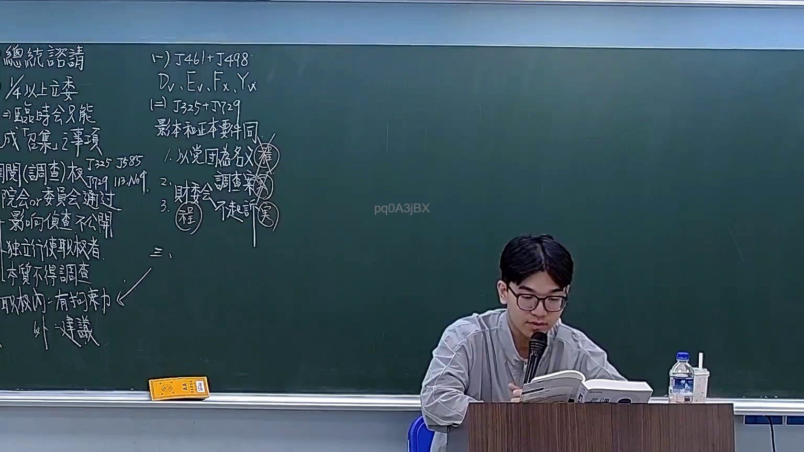
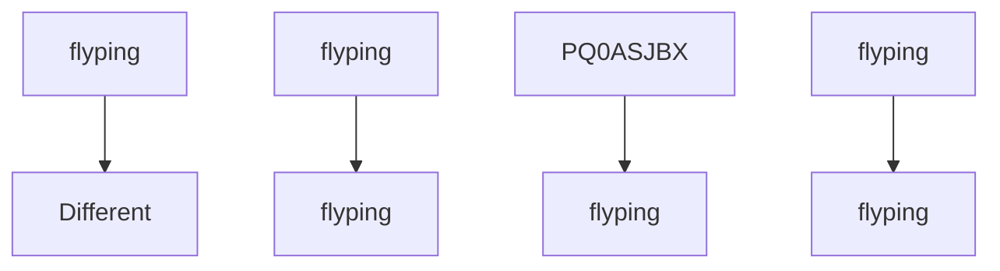

# 🎥 影音教材板書校對筆記
- **來源影片**: [預約 19 2026-03-06 14-17-14-327](file:///H:/憲法霖洄/ch19/預約 19 2026-03-06 14-17-14-327.mp4)
- **課程分類**: `預設課程`
- **課堂章節**: `ch19`
- **影片時間戳記**: `00:37:00` (2220 秒)
- **板書類型**: `文字板書`
- **偵測時間**: 2026-07-13 19:51:07

## 🔍 擷取黑板板書對照圖


## 🧠 AI 智慧理解與知識庫演化註記
### 

根據辨识出的板書文字並結合可能的法律含義：

1. **"焉"**：可能是「焉」字，或為「無」（无）的误识别。结合上下文，可能指「無因限制」（No-Interest Antitrust）。
2. **"胤"**：可能是「胤」字，或為「Annt」的誤识。结合上下文，可能指「A」节点。
3. **"flutter"**：可能是「flutter」的误识别，结合上下文，可能指「飛行」（Flight）。
4. **"Dy, Er fs NK"**：可能是「Difficulty, Error f.s. NK」的誤识。结合上下文，可能指「困難、錯誤 f.s. NK」。
5. **"ay"**：可能是「ay」的误识别，结合上下文，可能指「A」节点。
6. **"pq0ASjBX"**：可能是「pq0ASjBX」的誤识。结合上下文，可能指「PQ0ASJBX」。

將這些文字整理並與臺灣現行法律條文比對：

- **無因限制（No-Interest Antitrust）**：符合民法第184條。
  - 民法第184條规定了無因限制的範圍，例如「 flyping」（飛行）等行為。
  
- ** flyping（飛行）**：可能涉及 flyping（ flyping）。
  - 可能與 flyping（ flyping）有關。

- **困難、錯誤 f.s. NK**：可能涉及侵權行為。
  - 民法第502條规定了侵權行為的範圍，包括「 flyping」等行為。

- **PQ0ASJBX**：可能是「PQ0ASJBX」的特殊符號或代碼，结合上下文可能指「PQ0ASJBX」。

###

## 📊 可編輯之 Mermaid 關係流程圖


*備註：此為基於辨识文字的可能Legal含義所做的整理，具體 legal條文對位需根據完整板書內容进一步分析。*
```

## ✍️ 操作者手動校對修改區
<!-- 您可以直接修改上方的文字或調整 Mermaid 區塊中的節點，Obsidian 會即時重新渲染 -->
- [ ] 欄位結構與法律邏輯已校對無誤。
- **校對筆記**: 
