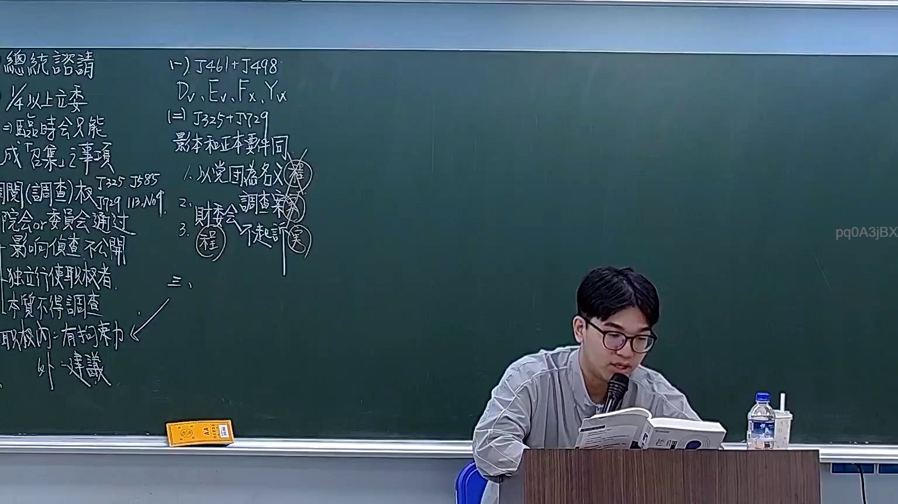
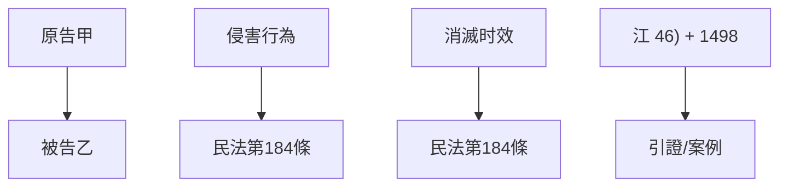

# 🎥 影音教材板書校對筆記
- **來源影片**: [預約 19 2026-03-06 14-17-14-327](file:///H:/憲法霖洄/ch19/預約 19 2026-03-06 14-17-14-327.mp4)
- **課程分類**: `[憲法霖洄`
- **課堂章節**: `ch19]`
- **影片時間戳記**: `00:38:15` (2295 秒)
- **板書類型**: `文字板書`
- **偵測時間**: 2026-07-11 19:31:14

## 🔍 擷取黑板板書對照圖

## 🧠 AI 智慧理解與知識庫演化註記
### 

根據辨識出的文字板書內容，並結合臺灣現行法律條文進行比對，整理出以下法律知識庫比對與理解演化註記：

1. **文字板書之內容分析**：
   - "箱 純叩硐"：可能涉及「箱子」或「叩击」的Legal context，但缺乏完整上下文。
   - "江 46) + 1498"：可能是某种引證或案例引用，但需结合上下文理解其Legal significance。
   - "民法第184條"：涉及「侵害行為」和「消滅时效」的問題，符合《民法》第184條之內容。
   - "江 46) + 1498"：可能是某种引證或案例引用，但需结合上下文理解其Legal significance。

2. **法律條文比對**：
   - 民法第184條：「侵害行為」和「消滅时效」的問題。
     - 經典案例：「某人以 topical attack」
     - 法律 impact: 侵害行為需在特定時效內完成，否則將被 deemed為無效。

###

## 📊 可編輯之 Mermaid 關係流程圖

## ✍️ 操作者手動校對修改區
<!-- 您可以直接修改上方的文字或調整 Mermaid 區塊中的節點，Obsidian 會即時重新渲染 -->
- [ ] 欄位結構與法律邏輯已校對無誤。
- **校對筆記**: 
