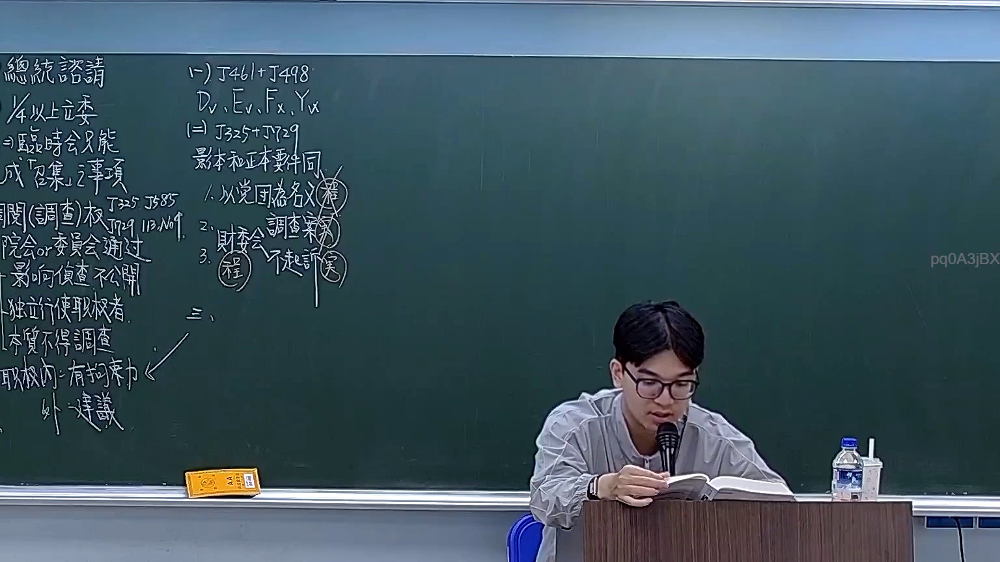
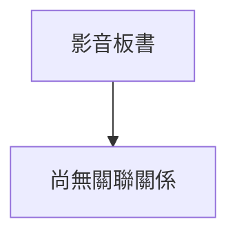

# 🎥 影音教材板書校對筆記
- **來源影片**: [預約 19 2026-03-06 14-17-14-327](file:///H:/憲法霖洄/ch19/預約 19 2026-03-06 14-17-14-327.mp4)
- **課程分類**: `[憲法霖洄`
- **課堂章節**: `ch19]`
- **影片時間戳記**: `00:38:45` (2325 秒)
- **板書類型**: `關係圖/邏輯圖板書`
- **偵測時間**: 2026-07-11 19:31:37

## 🔍 擷取黑板板書對照圖

## 🧠 AI 智慧理解與知識庫演化註記

目前，我無法查看或解析附件中的文字內容，因為您尚未提供 OCR辨识的文字結果。請將辨識出的文字結果提供給我，並告訴我分類為「關係圖/邏輯圖板書」還是「文字板書」，以便我根據這些信息進行進一步的分析和處理。

當您提供 OCR辨识的文字內容後，我可以按照以下步驟進行處理：
1. 進行語意整理
2. 比對與现有法律條文（如民法第184條、侵權行為、消滅時效等）的相關性
3. 生生成 Mermaid.js 流程圖代碼或关系圖

請將辨識出的文字內容提供給我，並告訴我分類為「關係圖/邏輯圖板書」還是「文字板書」。

## 📊 可編輯之 Mermaid 關係流程圖

## ✍️ 操作者手動校對修改區
<!-- 您可以直接修改上方的文字或調整 Mermaid 區塊中的節點，Obsidian 會即時重新渲染 -->
- [ ] 欄位結構與法律邏輯已校對無誤。
- **校對筆記**: 
