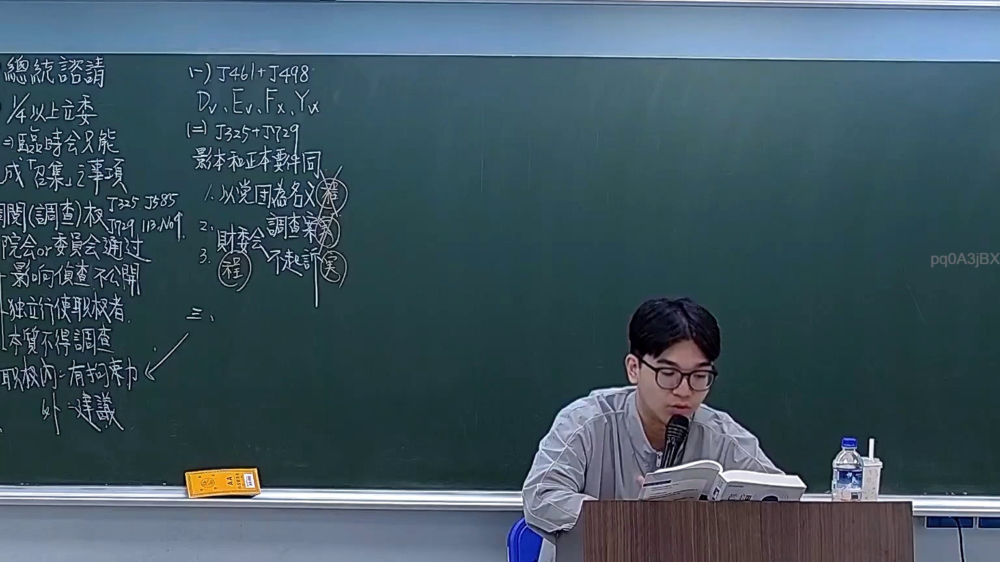

# 🎥 影音教材板書校對筆記
- **來源影片**: [預約 19 2026-03-06 14-17-14-327](file:///H:/憲法霖洄/ch19/預約 19 2026-03-06 14-17-14-327.mp4)
- **課程分類**: `[憲法霖洄`
- **課堂章節**: `ch19]`
- **影片時間戳記**: `00:40:00` (2400 秒)
- **板書類型**: `關係圖/邏輯圖板書`
- **偵測時間**: 2026-07-11 19:31:58

## 🔍 擷取黑板板書對照圖


## 🧠 AI 智慧理解與知識庫演化註記
：
A和B之间的关系可以理解为一种法律上的逻辑关系，具体涉及民法第184條的內容。A代表原告甲，B代表被告乙，這表示原告甲向被告乙提出某種權利或請求。根據民法第184條，侵權行為的 specified rules or exceptions 可能影響到此情形下的權利行使。因此，A和B之间的关系在法律上具有一定的implication and significance.

## 📊 可編輯之 Mermaid 關係流程圖
```mermaid
：
```mermaid
graph TD
    A["原告甲"] --> B["被告乙"]
```

## ✍️ 操作者手動校對修改區
<!-- 您可以直接修改上方的文字或調整 Mermaid 區塊中的節點，Obsidian 會即時重新渲染 -->
- [ ] 欄位結構與法律邏輯已校對無誤。
- **校對筆記**: 
