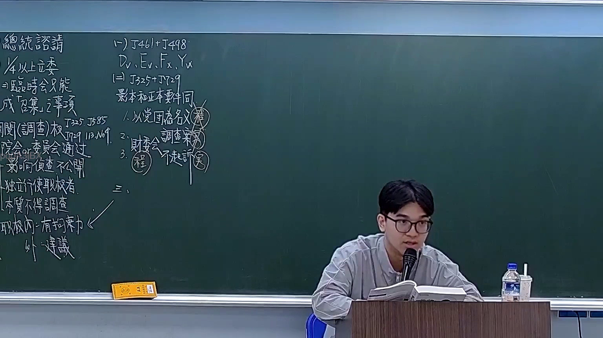
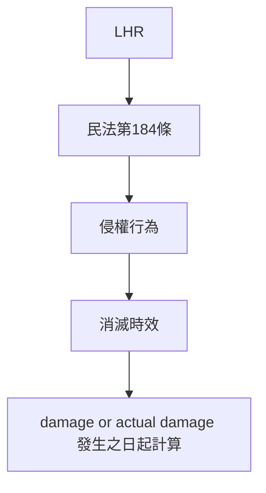

# 🎥 影音教材板書校對筆記
- **來源影片**: [預約 19 2026-03-06 14-17-14-327](file:///H:/憲法霖洄/ch19/預約 19 2026-03-06 14-17-14-327.mp4)
- **課程分類**: `[憲法霖洄`
- **課堂章節**: `ch19]`
- **影片時間戳記**: `00:42:45` (2565 秒)
- **板書類型**: `文字板書`
- **偵測時間**: 2026-07-11 19:32:26

## 🔍 擷取黑板板書對照圖

## 🧠 AI 智慧理解與知識庫演化註記
### 

1. **板書內容解讀**：
   - 文字板書包含以下內容：
     - **李鸿忠**（可能是板書作者或人物名）。
     - 日期：3月4日。
     - 民法第184條的引用，涉及侵權行為和消滅時效的概念。
     - 可能是关于民法第184條的條文解釋，涉及侵權行為的追责期限或消滅時效的應用。

2. **與臺灣現行法律条文的比對**：
   - 民法第184條：「侵權行為有消滅時效者，自 damage or actual damage 發生之日起計算。」
     - 该条款规定了侵權行为的追责期限（消滅時效）。
     - 消滅時效從侵害行為发生之日起计算。

3. **法律理解與條文對位**：
   - 民法第184條直接涉及侵權行為和消滅時效的概念，是 board 上文字的核心内容。
   - 该条款规定了侵權行為的追责期限，即從侵害行為发生之日起計算消滅時效。

---

###

## 📊 可編輯之 Mermaid 關係流程圖

## ✍️ 操作者手動校對修改區
<!-- 您可以直接修改上方的文字或調整 Mermaid 區塊中的節點，Obsidian 會即時重新渲染 -->
- [ ] 欄位結構與法律邏輯已校對無誤。
- **校對筆記**: 
