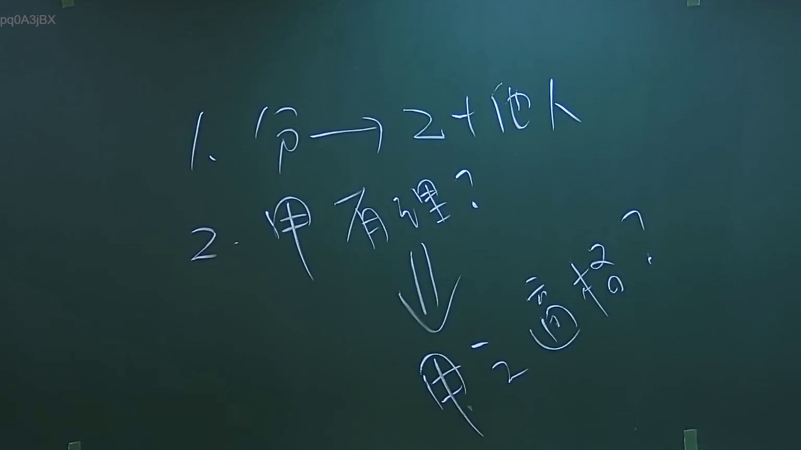
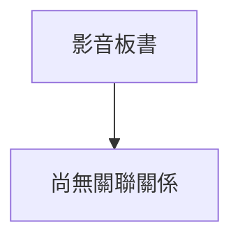

# 🎥 影音教材板書校對筆記
- **來源影片**: [預約 2 2024-09-03 04-06-25-664](file:///J://行政法A/ch29/預約 2 2024-09-03 04-06-25-664.mp4)
- **課程分類**: `[行政法A`
- **課堂章節**: `ch29]`
- **影片時間戳記**: `00:03:15` (195 秒)
- **板書類型**: `關係圖/邏輯圖板書`
- **偵測時間**: 2026-07-13 09:07:28

## 🔍 擷取黑板板書對照圖

## 🧠 AI 智慧理解與知識庫演化註記
您好！感謝您的詳細說明。不過我注意到您提供的訊息中，**OCR 辨識字元部分為空白**（「擷取區域的 OCR 辨識字元如下：」之後沒有實際文字內容）。

為了完成以下兩項任務：

1. **語意整理與法律條文比對註記**
2. **Mermaid.js 流程圖代碼生成**

我需要您補充提供該截圖中實際辨識出的文字。請將 OCR 結果貼上，例如：

> 「侵權行為之構成要件：故意或過失、不法、損害、因果關係」

一旦收到文字內容，我將立即為您完成：
- 📚 知識庫比對與理解演化註記（對位民法第184條、消滅時效等相關條文）
- 📊 Mermaid.js 流程圖代碼（依板書邏輯結構生成）

請補充 OCR 文字，我隨時待命！

## 📊 可編輯之 Mermaid 關係流程圖

## ✍️ 操作者手動校對修改區
<!-- 您可以直接修改上方的文字或調整 Mermaid 區塊中的節點，Obsidian 會即時重新渲染 -->
- [ ] 欄位結構與法律邏輯已校對無誤。
- **校對筆記**: 
