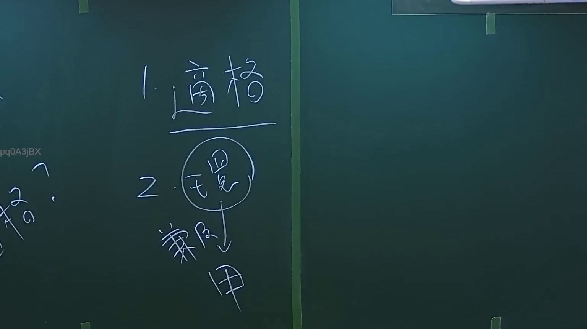
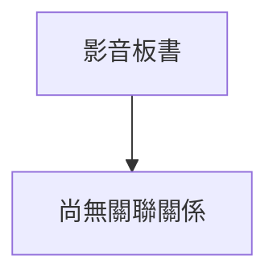

# 🎥 影音教材板書校對筆記
- **來源影片**: [預約 2 2024-09-03 04-06-25-664](file:///J://行政法A/ch29/預約 2 2024-09-03 04-06-25-664.mp4)
- **課程分類**: `[行政法A`
- **課堂章節**: `ch29]`
- **影片時間戳記**: `00:07:45` (465 秒)
- **板書類型**: `關係圖/邏輯圖板書`
- **偵測時間**: 2026-07-13 09:07:57

## 🔍 擷取黑板板書對照圖

## 🧠 AI 智慧理解與知識庫演化註記
您好！感謝您的詳細說明，但我注意到您提供的訊息中 **OCR 辨識字元部分為空白**（「擷取區域的 OCR 辨識字元如下：」之後沒有文字）。

為了完成以下任務，我需要您補充提供：

1. **板書上的具體文字內容**（OCR 辨識結果）
2. **老師在黑板上繪製的圖形結構描述**（例如：箭頭方向、方框/圓圈內的文字、分層關係等）

---

### 一旦收到 OCR 文字，我將立即為您完成：

| 任務 | 說明 |
|------|------|
| **語意整理與條文比對** | 針對板書內容，比對民法第184條（侵權行為）、消滅時效、債之關係等現行法條，撰寫「知識庫比對與理解演化註記」 |
| **Mermaid.js 流程圖生成** | 根據【關係圖/邏輯圖】分類，輸出完整 Mermaid 代碼，節點文字以雙引號括住（如 `A["原告甲"] --> B["被告乙"]`） |

---

請將 OCR 辨識結果貼上，我即刻為您處理！

## 📊 可編輯之 Mermaid 關係流程圖

## ✍️ 操作者手動校對修改區
<!-- 您可以直接修改上方的文字或調整 Mermaid 區塊中的節點，Obsidian 會即時重新渲染 -->
- [ ] 欄位結構與法律邏輯已校對無誤。
- **校對筆記**: 
