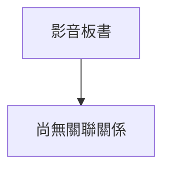

# 🎥 影音教材板書校對筆記
- **來源影片**: [預約 2 2024-09-03 04-06-25-664](file:///J://行政法A/ch29/預約 2 2024-09-03 04-06-25-664.mp4)
- **課程分類**: `[行政法A`
- **課堂章節**: `ch29]`
- **影片時間戳記**: `00:09:00` (540 秒)
- **板書類型**: `關係圖/邏輯圖板書`
- **偵測時間**: 2026-07-13 09:08:22

## 🔍 擷取黑板板書對照圖

## 🧠 AI 智慧理解與知識庫演化註記
：

您好，您提供的訊息中「擷取區域的 OCR 辨識字元如下：」之後**未附實際文字內容**。因此我無法進行語意整理、條文比對或生成 Mermaid 圖表。

請您將該時間點（9分0秒）截圖中的 **OCR 辨識字串** 貼上，我會立即為您完成以下工作：

1. 📖 **語意整理與知識庫比對註記**
   - 針對板書文字進行法律概念歸納
   - 自動比對臺灣現行條文（如民法第184條侵權行為、消滅時效等）
   - 撰寫「知識庫比對與理解演化註記」

2. 📊 **Mermaid.js 流程圖代碼**
   - 若為關係圖/邏輯圖：生成對應的 graph TD 結構
   - 若為文字板書：整理成條列式邏輯樹
   - 所有節點文字以雙引號括住，確保語法正確

請補充 OCR 字串後再發一次，我即刻為您處理。

## 📊 可編輯之 Mermaid 關係流程圖

## ✍️ 操作者手動校對修改區
<!-- 您可以直接修改上方的文字或調整 Mermaid 區塊中的節點，Obsidian 會即時重新渲染 -->
- [ ] 欄位結構與法律邏輯已校對無誤。
- **校對筆記**: 
