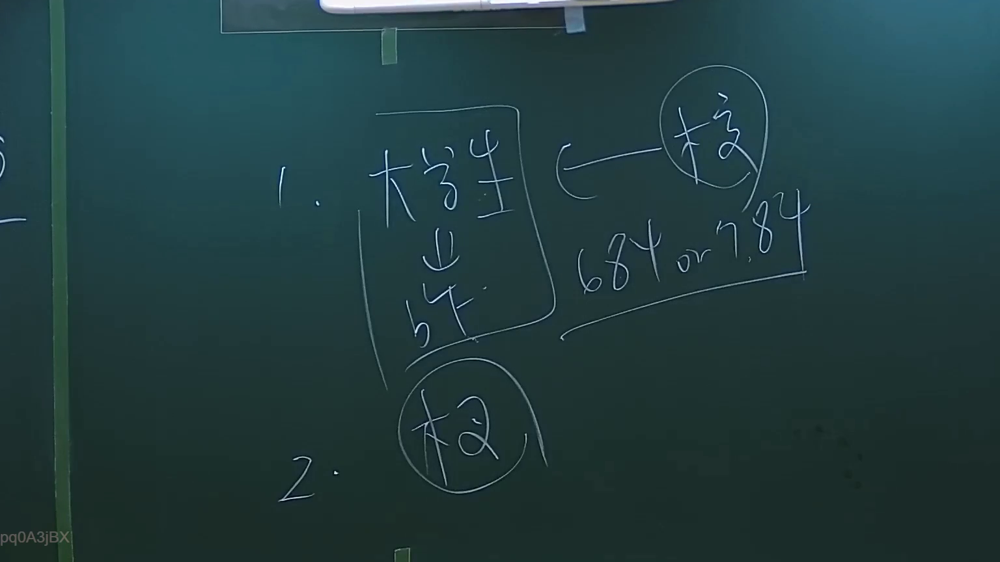

# 🎥 影音教材板書校對筆記
- **來源影片**: [預約 2 2024-09-03 04-06-25-664](file:///J://行政法A/ch29/預約 2 2024-09-03 04-06-25-664.mp4)
- **課程分類**: `[行政法A`
- **課堂章節**: `ch29]`
- **影片時間戳記**: `00:13:00` (780 秒)
- **板書類型**: `關係圖/邏輯圖板書`
- **偵測時間**: 2026-07-13 09:08:58

## 🔍 擷取黑板板書對照圖


## 🧠 AI 智慧理解與知識庫演化註記
：

您好！您的訊息中「擷取區域的 OCR 辨識字元」部分為空白，未實際提供辨識出的文字內容。因此我無法進行語意整理、條文比對及生成對應的 Mermaid 代碼。

請您補充以下任一資訊後，我再為您完成分析：

1. **直接貼上 OCR 辨識出的文字**（即使有錯字或斷行問題也無妨）
2. 或描述老師在該時間點（13分0秒）所書寫的板書內容與邏輯關係

---

**預判說明**（基於《預約》主題的臺灣民法知識，供您參考）：

若此為「民法第565條 預約」相關板書，常見知識庫比對方向包括：

| 法律概念 | 對應條文 | 實務重點 |
|---------|---------|---------|
| 預約之效力 | 民法 §565 | 當事人應依約訂定本約；違約時得請求損害賠償或解除契約 |
| 本約成立要件 | 民法 §153、§472 | 標的物特定、價金約定明確 |
| 違約責任 | 民法 §226、§259 | 債務不履行之補償範圍 |
| 消滅時效 | 民法 §125（一般15年）、§197（侵權行為2年） | 預約違約請求權之時效起算點 |

請提供 OCR 文字，我將立即為您生成完整的及

## 📊 可編輯之 Mermaid 關係流程圖
```mermaid
。
```

## ✍️ 操作者手動校對修改區
<!-- 您可以直接修改上方的文字或調整 Mermaid 區塊中的節點，Obsidian 會即時重新渲染 -->
- [ ] 欄位結構與法律邏輯已校對無誤。
- **校對筆記**: 
