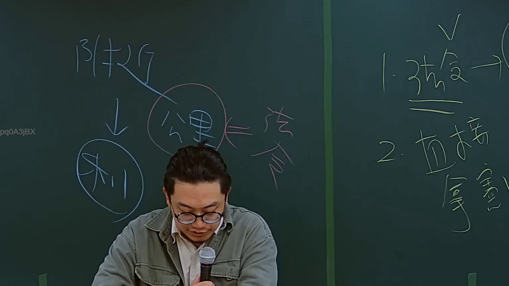
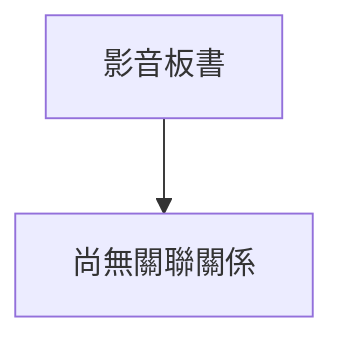

# 🎥 影音教材板書校對筆記
- **來源影片**: [預約 2 2024-09-03 04-06-25-664](file:///J://行政法A/ch29/預約 2 2024-09-03 04-06-25-664.mp4)
- **課程分類**: `[行政法A`
- **課堂章節**: `ch29]`
- **影片時間戳記**: `00:17:15` (1035 秒)
- **板書類型**: `關係圖/邏輯圖板書`
- **偵測時間**: 2026-07-13 09:09:29

## 🔍 擷取黑板板書對照圖

## 🧠 AI 智慧理解與知識庫演化註記
：

您好，您提供的訊息中「擷取區域的 OCR 辨識字元」部分為空白，未偵測到實際的文字內容。因此我無法針對具體板書文字進行語意整理、條文比對或生成對應的 Mermaid 代碼。

請您重新提供以下任一資訊：
1. **OCR 辨識出的原始字串**（即使有錯別字也無妨，我會自行校正）
2. **截圖圖片**（我可直接從圖片中辨識文字）
3. **手動輸入板書上的關鍵文字或邏輯關係**

一旦取得內容，我將立即為您完成：
- 語意整理與民法第184條、侵權行為責任、消滅時效等條文的比對註記
- 對應的 Mermaid.js 流程圖代碼（含雙引號包裹節點文字）

請補充資料後再發一次，謝謝！

## 📊 可編輯之 Mermaid 關係流程圖

## ✍️ 操作者手動校對修改區
<!-- 您可以直接修改上方的文字或調整 Mermaid 區塊中的節點，Obsidian 會即時重新渲染 -->
- [ ] 欄位結構與法律邏輯已校對無誤。
- **校對筆記**: 
