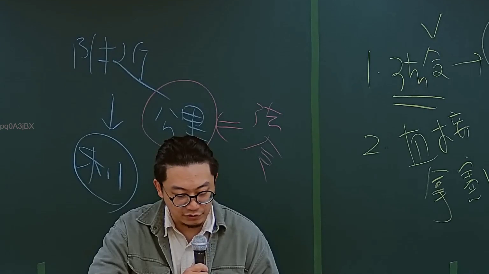
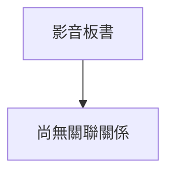

# 🎥 影音教材板書校對筆記
- **來源影片**: [預約 2 2024-09-03 04-06-25-664](file:///J://行政法A/ch29/預約 2 2024-09-03 04-06-25-664.mp4)
- **課程分類**: `[行政法A`
- **課堂章節**: `ch29]`
- **影片時間戳記**: `00:20:15` (1215 秒)
- **板書類型**: `關係圖/邏輯圖板書`
- **偵測時間**: 2026-07-13 09:10:09

## 🔍 擷取黑板板書對照圖


## 🧠 AI 智慧理解與知識庫演化註記
：

您好，您提供的訊息中「擷取區域的 OCR 辨識字元」部分為空白，未實際附上辨識出的文字內容。因此我無法針對具體板書進行語意整理與條文比對。

不過，基於課程名稱《預約》及時間點（20分15秒），我可以先提供**「預約」相關知識框架**供您參考，待您補充 OCR 字元後即可立即完成完整分析：

---

### 📚 「預約」之法律知識框架（民法第489-493條）

| 概念 | 條文對位 | 說明 |
|------|----------|------|
| **預約性質** | 民法第489條 | 契約之一種，約定於一定期限內為本約之締結 |
| **本約義務** | 民法第490條 | 當事人應依預約內容訂立本約（有債權效力） |
| **違約責任** | 民法第491條 | 一方拒絕締結本約者，他方得請求損害賠償 |
| **消滅時效** | 民法第125-131條 | 一般侵權行為為2年（第197條），預約違約請求權為一般債權時效15年（第125條） |
| **與侵權行為之關係** | 民法第184條 | 若因故意或過失侵害他人權利，可構成侵權行為；但預約違約屬契約責任，原則上適用第491條而非第184條 |

---

### 🔑 關鍵法律邏輯（待 OCR 字元補充後精確對位）：

```
預約 → 本約締結義務（債權關係）
    ├── 有效預約 → 得請求訂立本約
    └── 違約拒絕 → 損害賠償請求（非侵權行為，除非有故意侵害權利之情形）
        └── 時效：一般15年（民法第125條），非2年侵權時效
```

---

請您**補充 OCR 辨識出的板書文字**，我將立即為您完成：
1. 語意整理與條文精確比對
2. Mermaid.js 關係圖代碼生成

## 📊 可編輯之 Mermaid 關係流程圖


## ✍️ 操作者手動校對修改區
<!-- 您可以直接修改上方的文字或調整 Mermaid 區塊中的節點，Obsidian 會即時重新渲染 -->
- [ ] 欄位結構與法律邏輯已校對無誤。
- **校對筆記**: 
