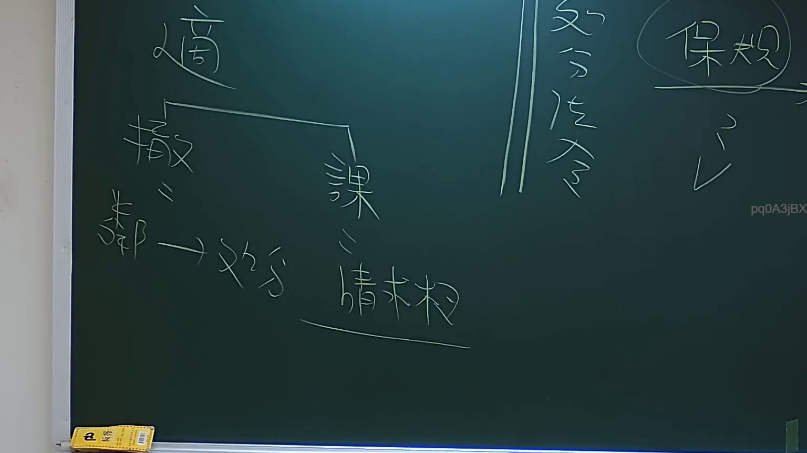
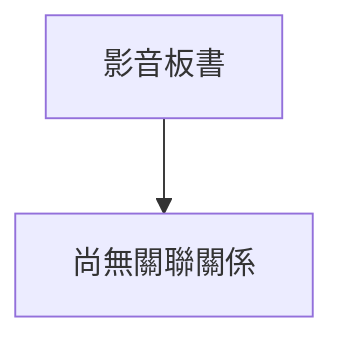

# 🎥 影音教材板書校對筆記
- **來源影片**: [預約 2 2024-09-03 04-06-25-664](file:///J://行政法A/ch29/預約 2 2024-09-03 04-06-25-664.mp4)
- **課程分類**: `[行政法A`
- **課堂章節**: `ch29]`
- **影片時間戳記**: `00:25:15` (1515 秒)
- **板書類型**: `關係圖/邏輯圖板書`
- **偵測時間**: 2026-07-13 09:10:37

## 🔍 擷取黑板板書對照圖

## 🧠 AI 智慧理解與知識庫演化註記
：

您好！我注意到您提供的 OCR 辨識字元部分為空白（「擷取區域的 OCR 辨識字元如下：」之後沒有實際文字內容）。因此，我無法針對具體板書文字進行語意整理、法律條文比對或生成對應的 Mermaid 流程圖。

為了能更精確地協助您，請您重新提供以下資訊：
1. **OCR 辨識出的完整板書文字**（包含所有可辨識的字元）
2. （如有需要）**板書中的圖畫結構描述**（例如箭頭方向、方框內容等）

一旦收到這些資料，我將立即為您完成：
- 📚 語意整理與臺灣現行法律條文比對（如民法第184條侵權行為責任、消滅時效等）
- 🔗 Mermaid.js 流程圖代碼生成（含正確雙引號格式）

請補充內容後再次發送，我將盡快為您處理！

## 📊 可編輯之 Mermaid 關係流程圖

## ✍️ 操作者手動校對修改區
<!-- 您可以直接修改上方的文字或調整 Mermaid 區塊中的節點，Obsidian 會即時重新渲染 -->
- [ ] 欄位結構與法律邏輯已校對無誤。
- **校對筆記**: 
