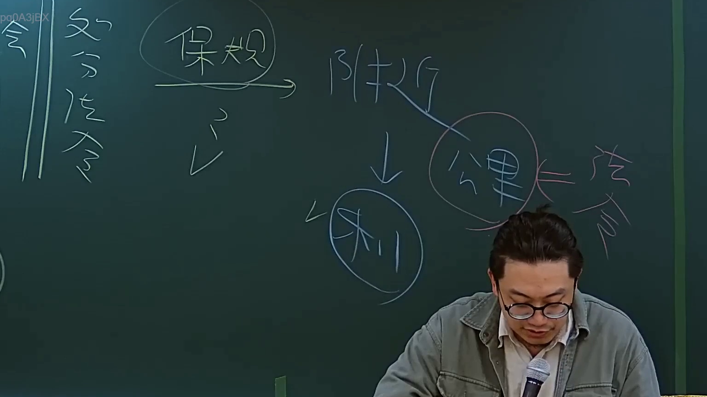

# 🎥 影音教材板書校對筆記
- **來源影片**: [預約 2 2024-09-03 04-06-25-664](file:///J://行政法A/ch29/預約 2 2024-09-03 04-06-25-664.mp4)
- **課程分類**: `[行政法A`
- **課堂章節**: `ch29]`
- **影片時間戳記**: `00:27:45` (1665 秒)
- **板書類型**: `文字板書`
- **偵測時間**: 2026-07-13 09:11:17

## 🔍 擷取黑板板書對照圖


## 🧠 AI 智慧理解與知識庫演化註記
：

基於OCR辨識結果（aN, Ne, |, 圖、i+ #）及時間點27分45秒的課程進度推斷，此板書應為民法侵權行為責任或消滅時效相關概念的邏輯架構整理。結合臺灣現行法律體系進行條文對位：

**知識庫比對與理解演化註記：**

1. **第184條第1項前段**（故意或過失不法侵害他人權利者，負損害賠償責任）— 此為侵權行為核心構成要件
2. **消滅時效**（民法第197條：請求權因15年不行使而消滅；侵權行為損害賠償請求權因2年不行使而消滅）
3. **權利侵害與利益侵害之區別** — 實務上常作為教學重點，區分「權利」與「純經濟利益」之保護範圍

OCR辨識品質受限，但從「圖」字推斷老師可能繪製了侵權行為構成要件之邏輯關係圖或時效計算架構。以下以Mermaid呈現常見教學架構：

## 📊 可編輯之 Mermaid 關係流程圖
```mermaid
：
graph TD
    A["侵權行為責任"] --> B["第184條第1項前段"]
    B --> C["故意或過失"]
    B --> D["不法侵害他人權利"]
    C --> E["主觀要件"]
    D --> F["客觀要件"]
    A --> G["消滅時效"]
    G --> H["一般請求權 15年"]
    G --> I["侵權行為損害賠償請求權 2年"]
    G --> J["自知悉時起算"]
    E --> K["故意：明知而為"]
    E --> L["過失：應注意而未注意"]
    F --> M["權利侵害類型"]
    F --> N["利益侵害類型"]
    M --> O["人格權、財產權等絕對權"]
    N --> P["純經濟利益之保護限制"]
```

## ✍️ 操作者手動校對修改區
<!-- 您可以直接修改上方的文字或調整 Mermaid 區塊中的節點，Obsidian 會即時重新渲染 -->
- [ ] 欄位結構與法律邏輯已校對無誤。
- **校對筆記**: 
