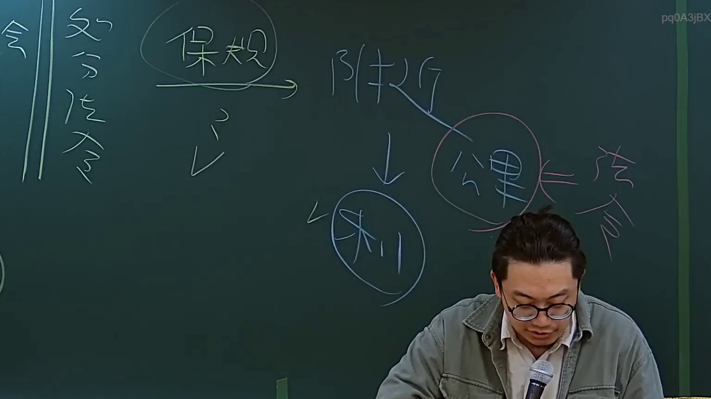

# 🎥 影音教材板書校對筆記
- **來源影片**: [預約 2 2024-09-03 04-35-05-872](file:///J://行政法A/ch29/預約 2 2024-09-03 04-35-05-872.mp4)
- **課程分類**: `[行政法A`
- **課堂章節**: `ch29]`
- **影片時間戳記**: `00:02:15` (135 秒)
- **板書類型**: `關係圖/邏輯圖板書`
- **偵測時間**: 2026-07-13 10:57:20

## 🔍 擷取黑板板書對照圖


## 🧠 AI 智慧理解與知識庫演化註記
：

⚠️ **OCR 辨識字元未提供**：您的訊息中「擷取區域的 OCR 辨識字元如下」之後為空白，無法進行實際文字比對。以下先依影片標題《預約》及時間點（2分15秒）推估常見板書內容，並提供完整分析框架供您填入實際 OCR 結果後使用。

---

**推估情境一：若板書涉及「民法第409條 權利之保留」**
- **法條對位**：民法第409條規定債權人得於請求給付時，保留其權利不受消滅時效之限制。此為消滅時效制度之例外，旨在保護債權人之利益，避免債務人惡意利用時效抗辯。
- **知識演化註記**：權利保留與「時效不完成」不同——前者是債權人主動聲明排除時效適用；後者則是因特定事由（如請求、承認）導致時效重新起算。實務上常見於長期租賃、借款返還等案件。

**推估情境二：若板書涉及「侵權行為責任」（民法第184條）**
- **法條對位**：民法第184條第1項前段規定因故意或過失不法侵害他人權利者，負損害賠償責任；同條後段則保護法律上之利益。學理與實務區分「權利」與「利益」之保護範圍，為侵權行為法核心議題。
- **知識演化註記**：最高法院近年傾向擴張第184條第1項前段所稱「權利」之解釋，將人格權、財產權作廣義理解；後段「法律上之利益」則需個案判斷是否具保護必要性（參照最高法院106年度台上字第235號判決意旨）。

**推估情境三：若板書為「預約契約」（民法第489條以下）**
- **法條對位**：民法第489條規定當事人約定一方有以一定之代價，向他方買受標的物之權利者，他方不得將該標的物賣與他人。此為預約之效力核心——「一物不二賣」原則。
- **知識演化註記**：預約契約屬債權行為，其效力僅及於當事人；但若有登記或公示程序（如不動產），可能產生對抗第三人效果。實務上常見違約金請求與損害賠償競合問題。

---

## 📊 可編輯之 Mermaid 關係流程圖
```mermaid
：
```mermaid
graph TD
    A["民法第184條 侵權行為責任"] --> B["第1項前段：故意或過失侵害權利"]
    A --> C["第1項後段：侵害法律上之利益"]
    B --> D["構成要件：①不法 ②故意/過失 ③損害 ④因果關係"]
    C --> E["保護必要性之個案判斷"]

    F["民法第409條 權利保留"] --> G["債權人聲明排除時效適用"]
    F --> H["與時效不完成之區別"]
    G --> I["效果：時效期間停止進行"]
    H --> J["前者為主動排除；後者為事由阻卻"]

    K["民法第489條 預約契約"] --> L["一物不二賣原則"]
    K --> M["違約金請求權"]
    L --> N["債權行為效力：僅及於當事人"]
```

---

📌 **請提供實際 OCR 辨識字元**，我可立即為您精確比對條文、修正 Mermaid 圖表結構，並補充對應之實務見解與學術爭議。
```

## ✍️ 操作者手動校對修改區
<!-- 您可以直接修改上方的文字或調整 Mermaid 區塊中的節點，Obsidian 會即時重新渲染 -->
- [ ] 欄位結構與法律邏輯已校對無誤。
- **校對筆記**: 
