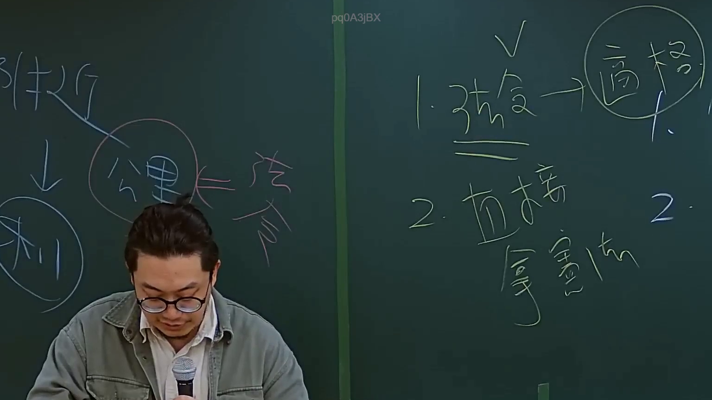
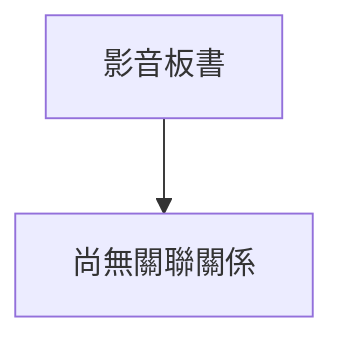

# 🎥 影音教材板書校對筆記
- **來源影片**: [預約 2 2024-09-03 04-35-05-872](file:///J://行政法A/ch29/預約 2 2024-09-03 04-35-05-872.mp4)
- **課程分類**: `[行政法A`
- **課堂章節**: `ch29]`
- **影片時間戳記**: `00:16:00` (960 秒)
- **板書類型**: `關係圖/邏輯圖板書`
- **偵測時間**: 2026-07-13 10:57:45

## 🔍 擷取黑板板書對照圖

## 🧠 AI 智慧理解與知識庫演化註記
：

您提供的訊息中，OCR 辨識字元區域為空白（未擷取到任何文字）。因此我無法進行以下工作：

1. **語意整理** — 無原始文字可分析。
2. **條文比對**（民法第184條、侵權行為、消滅時效等）— 無內容可對位。
3. **Mermaid.js 流程圖生成** — 無結構資料可依繪製。

---

請您補充以下任一方式，我即可立即完成分析：

- **貼上 OCR 辨識出的文字**（即使有錯字也無妨）；
- 或提供該時間點板書的**截圖/圖片**，我可自行進行 OCR 辨識後再處理。

一旦取得內容，我會依您的要求輸出完整的法律條文比對註記與 Mermaid 代碼。

## 📊 可編輯之 Mermaid 關係流程圖

## ✍️ 操作者手動校對修改區
<!-- 您可以直接修改上方的文字或調整 Mermaid 區塊中的節點，Obsidian 會即時重新渲染 -->
- [ ] 欄位結構與法律邏輯已校對無誤。
- **校對筆記**: 
