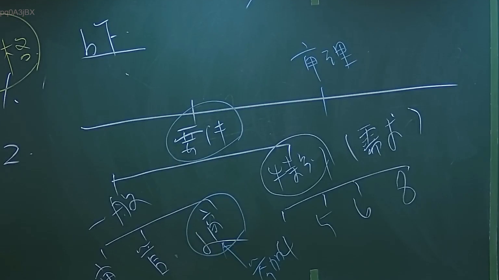
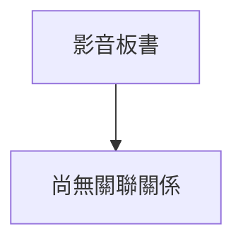

# 🎥 影音教材板書校對筆記
- **來源影片**: [預約 2 2024-09-03 04-35-05-872](file:///J://行政法A/ch29/預約 2 2024-09-03 04-35-05-872.mp4)
- **課程分類**: `[行政法A`
- **課堂章節**: `ch29]`
- **影片時間戳記**: `00:20:45` (1245 秒)
- **板書類型**: `關係圖/邏輯圖板書`
- **偵測時間**: 2026-07-13 10:58:14

## 🔍 擷取黑板板書對照圖

## 🧠 AI 智慧理解與知識庫演化註記
：

您好！您的 OCR 辨識字元區域似乎為空白或未能成功擷取文字內容。為了完成以下兩項任務，我需要您提供實際的板書 OCR 辨識結果：

1. **知識庫比對與理解演化註記** — 需要辨識出的具體法律條文、術語或概念才能進行語意整理與條文對位（如民法第184條侵權行為責任、消滅時效等）。
2. **Mermaid.js 流程圖代碼** — 需要板書上的邏輯關係文字（例如：「原告甲 → 被告乙」、「構成要件 A → B → C」等）才能生成對應的圖表結構。

---

請您重新提供 OCR 辨識出的字元內容，格式不限（可直接貼上文字），我將立即為您完成：
- 📚 法律條文比對與註記
- 📊 Mermaid.js 關係圖代碼

## 📊 可編輯之 Mermaid 關係流程圖

## ✍️ 操作者手動校對修改區
<!-- 您可以直接修改上方的文字或調整 Mermaid 區塊中的節點，Obsidian 會即時重新渲染 -->
- [ ] 欄位結構與法律邏輯已校對無誤。
- **校對筆記**: 
