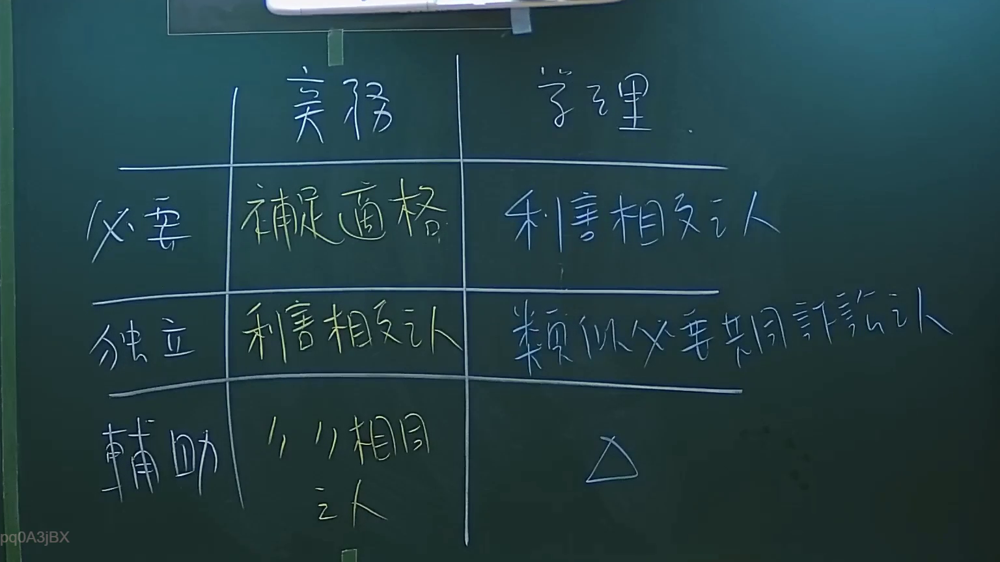

# 🎥 影音教材板書校對筆記
- **來源影片**: [預約 2 2024-09-03 04-35-05-872](file:///J://行政法A/ch29/預約 2 2024-09-03 04-35-05-872.mp4)
- **課程分類**: `[行政法A`
- **課堂章節**: `ch29]`
- **影片時間戳記**: `00:27:45` (1665 秒)
- **板書類型**: `關係圖/邏輯圖板書`
- **偵測時間**: 2026-07-13 10:58:57

## 🔍 擷取黑板板書對照圖


## 🧠 AI 智慧理解與知識庫演化註記
您好，我注意到您提供的訊息中 **OCR 辨識字元為空白**（「擷取區域的 OCR 辨識字元如下：」之後沒有文字）。

為了完成以下任務：

1. ✅ 語意整理與臺灣現行法律條文比對（如民法第245-1條未盡先契約義務之侵權行為、消滅時效等）
2. ✅ 生成 Mermaid.js 關係圖/邏輯圖代碼

**請您補充提供該時間點的 OCR 辨識文字內容**，我將立即為您完成：

- ：條文對位與法律理解說明
-

## 📊 可編輯之 Mermaid 關係流程圖
```mermaid
：完整可渲染的 Mermaid 流程圖程式碼

期待您的回覆！
```

## ✍️ 操作者手動校對修改區
<!-- 您可以直接修改上方的文字或調整 Mermaid 區塊中的節點，Obsidian 會即時重新渲染 -->
- [ ] 欄位結構與法律邏輯已校對無誤。
- **校對筆記**: 
