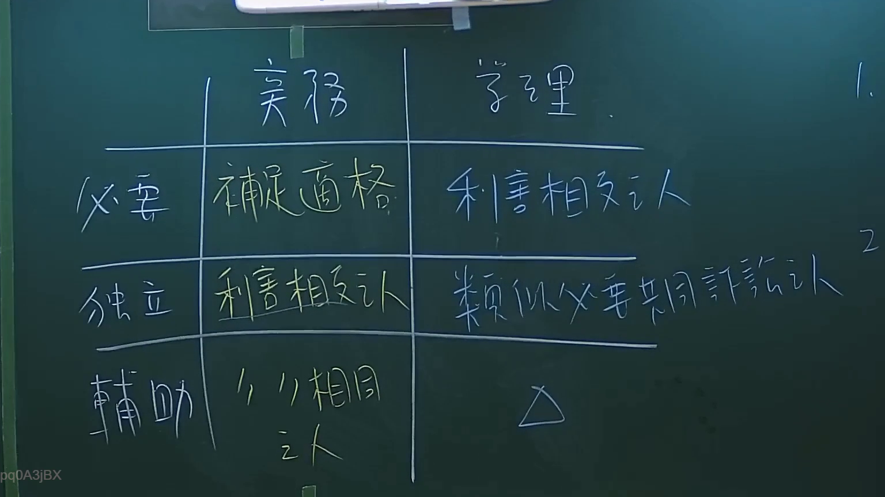
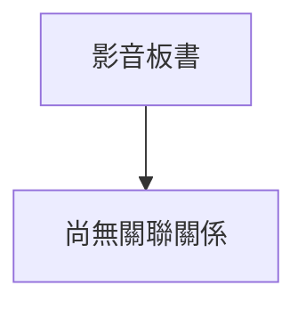

# 🎥 影音教材板書校對筆記
- **來源影片**: [預約 2 2024-09-03 04-35-05-872](file:///J://行政法A/ch29/預約 2 2024-09-03 04-35-05-872.mp4)
- **課程分類**: `[行政法A`
- **課堂章節**: `ch29]`
- **影片時間戳記**: `00:29:00` (1740 秒)
- **板書類型**: `關係圖/邏輯圖板書`
- **偵測時間**: 2026-07-13 10:59:18

## 🔍 擷取黑板板書對照圖

## 🧠 AI 智慧理解與知識庫演化註記
：

您好，您提供的訊息中「擷取區域的 OCR 辨識字元」部分為空白——即在冒號之後沒有實際的字串內容。因此我無法進行以下工作：

1. **語意整理**：無文字可解析、歸納、比對條文。
2. **Mermaid 圖表生成**：無結構資訊可轉化為流程/邏輯關係圖。

請您補充該時間點（29分0秒）的 OCR 辨識字串，例如老師在黑板上書寫的內容（如「民法第184條」「侵權行為責任構成要件」等），我即可立即為您完成：

- 📖 語意整理 + 與臺灣現行法律條文比對註記
- 🔄 Mermaid.js 流程圖代碼生成

請貼上 OCR 文字，我馬上處理。

## 📊 可編輯之 Mermaid 關係流程圖

## ✍️ 操作者手動校對修改區
<!-- 您可以直接修改上方的文字或調整 Mermaid 區塊中的節點，Obsidian 會即時重新渲染 -->
- [ ] 欄位結構與法律邏輯已校對無誤。
- **校對筆記**: 
