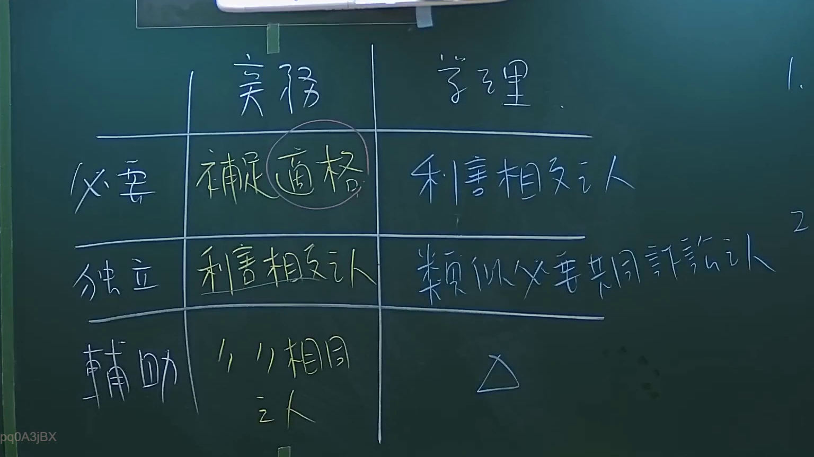
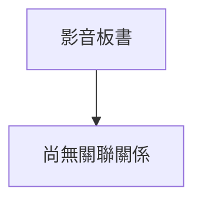

# 🎥 影音教材板書校對筆記
- **來源影片**: [預約 2 2024-09-03 04-35-05-872](file:///J://行政法A/ch29/預約 2 2024-09-03 04-35-05-872.mp4)
- **課程分類**: `[行政法A`
- **課堂章節**: `ch29]`
- **影片時間戳記**: `00:30:15` (1815 秒)
- **板書類型**: `關係圖/邏輯圖板書`
- **偵測時間**: 2026-07-13 10:59:40

## 🔍 擷取黑板板書對照圖

## 🧠 AI 智慧理解與知識庫演化註記
您好！感謝您的提問。不過我注意到您的訊息中，在「擷取區域的 OCR 辨識字元如下：」之後**沒有附上實際的文字內容**。OCR 辨識結果似乎遺漏了。

為了能協助您完成以下事項：

1. **語意整理與法律條文比對**（如民法第184條侵權行為、消滅時效等）
2. **生成 Mermaid.js 流程圖代碼**（關係圖/邏輯圖板書）

請您將 OCR 辨識出的文字內容補充提供給我，我即可立即為您：

- 進行語意整理與臺灣現行法律條文對位分析
- 撰寫「知識庫比對與理解演化註記」
- 生成對應的 Mermaid.js 代碼（含雙引號節點格式）

請貼上 OCR 文字，我馬上為您處理！

## 📊 可編輯之 Mermaid 關係流程圖

## ✍️ 操作者手動校對修改區
<!-- 您可以直接修改上方的文字或調整 Mermaid 區塊中的節點，Obsidian 會即時重新渲染 -->
- [ ] 欄位結構與法律邏輯已校對無誤。
- **校對筆記**: 
