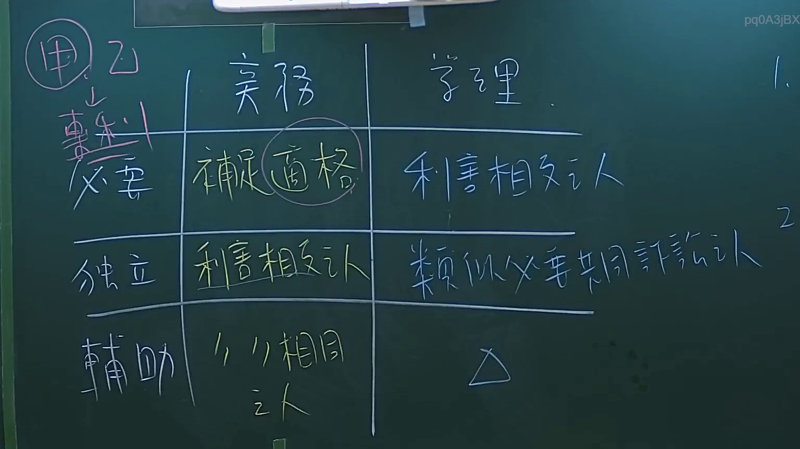

# 🎥 影音教材板書校對筆記
- **來源影片**: [預約 2 2024-09-03 04-35-05-872](file:///J://行政法A/ch29/預約 2 2024-09-03 04-35-05-872.mp4)
- **課程分類**: `[行政法A`
- **課堂章節**: `ch29]`
- **影片時間戳記**: `00:32:15` (1935 秒)
- **板書類型**: `關係圖/邏輯圖板書`
- **偵測時間**: 2026-07-13 11:00:25

## 🔍 擷取黑板板書對照圖


## 🧠 AI 智慧理解與知識庫演化註記
：

⚠️ **OCR 辨識字元未提供**：您的訊息中「擷取區域的 OCR 辨識字元如下：」之後為空白，實際板書文字內容尚未附上。因此無法進行具體的文字語意整理與條文比對。

不過，基於您提供的上下文資訊（時間點、分類類型、提及民法第184條、侵權行為、消滅時效），我推測此段板書可能涉及以下常見法律邏輯結構：

**可能的知識庫比對方向：**
- **民法第184條第1項前段**：故意或過失不法侵害他人權利者，負損害賠償責任。
- **民法第195條**：侵害人格權之非財產上損害賠償（慰撫金）。
- **民法第276條**：消滅時效因請求而中斷。
- **侵權行為構成要件關係圖**：違法性 → 歸責原則（過失責任/無過失責任）→ 因果關係 → 損害填補。

---

## 📊 可編輯之 Mermaid 關係流程圖
```mermaid
：

```mermaid
graph TD
    A["侵權行為請求權"] --> B["構成要件"]
    B --> C["違法性"]
    B --> D["歸責原則"]
    B --> E["因果關係"]
    B --> F["損害填補"]
    
    C --> G["故意或過失不法侵害他人權利 民法第184條第1項前段"]
    C --> H["權利侵害說 / 法律利益侵害說"]
    
    D --> I["過失責任原則 民法第184條第2項"]
    D --> J["無過失責任 / 危險責任"]
    
    E --> K["相當因果關係說"]
    E --> L["可歸責性"]
    
    F --> M["財產上損害賠償"]
    F --> N["非財產上損害賠償 慰撫金 民法第195條"]
    
    O["消滅時效"] --> P["一般請求權時效 民法第125條 15年"]
    O --> Q["侵權行為時效中斷 民法第276條"]
```

---

**請補充 OCR 辨識字元內容**，我將立即為您進行精確的語意整理、條文比對與 Mermaid 圖表生成。
```

## ✍️ 操作者手動校對修改區
<!-- 您可以直接修改上方的文字或調整 Mermaid 區塊中的節點，Obsidian 會即時重新渲染 -->
- [ ] 欄位結構與法律邏輯已校對無誤。
- **校對筆記**: 
