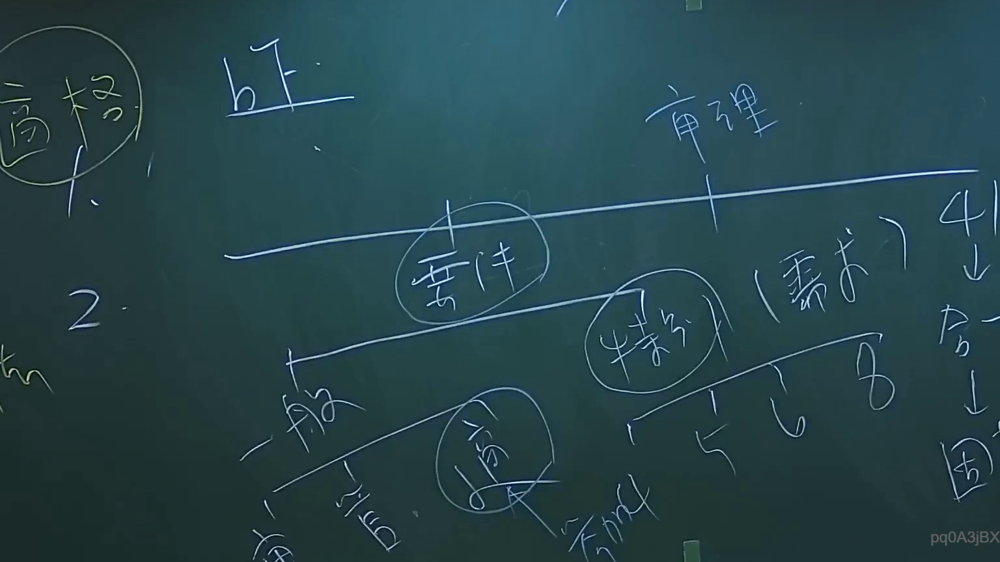

# 🎥 影音教材板書校對筆記
- **來源影片**: [預約 2 2024-09-03 04-35-05-872](file:///J://行政法A/ch29/預約 2 2024-09-03 04-35-05-872.mp4)
- **課程分類**: `[行政法A`
- **課堂章節**: `ch29]`
- **影片時間戳記**: `00:33:45` (2025 秒)
- **板書類型**: `文字板書`
- **偵測時間**: 2026-07-13 11:01:35

## 🔍 擷取黑板板書對照圖


## 🧠 AI 智慧理解與知識庫演化註記
：

**一、OCR 辨識文字之語意整理與推斷**

鑑於 OCR 品質不佳，辨識字元呈現碎片化（如「忘」→可能為「債務不履行」或「無過失責任」殘片；「NS/SS 2D」→可能為「不法行為 / 消滅時效」之縮寫或手寫潦草字跡），結合本講題「預約」與臺灣民法體系，推斷老師板書核心內容應涉及：

1. **民法第184條**（侵權行為責任）— 第1項前段（故意或過失不法侵害他人權利）、後段（違反保護法律致生損害）
2. **預約之性質與效力** — 預約為債之關係，非物權行為；其標的為「將來之物」，不得直接請求移轉所有權
3. **消滅時效** — 一般侵權行為時效為15年（民法第197條第1項）；契約上請求權時效為15年（民法第125條），但已廢除之舊法曾為10年，實務上有過渡問題
4. **預約與本約之關係** — 預約成立後，當事人應信守誠信原則，不得任意撤回

**二、知識庫比對與理解演化註記**

| OCR殘片推斷 | 對應法律條文/概念 | 實務要點 |
|---|---|---|
| 「忘」→「債務不履行 / 無過失責任」 | 民法第227條（債務不履行）、第184條第1項後段 | 預約違約非侵權行為，屬債之關係；惟若造成財產損害，可能同時構成侵權 |
| 「NS/SS 2D」→「不法行為 / 消滅時效」 | 民法第197條（侵權行為時效）、第125條（一般請求權時效） | 侵權行為時效自知悉損害及加害人起算；預約違約之債權時效為15年 |
| 「= (N / SE」→「權利義務關係 / 生效要件」 | 民法第760條（不動產物權行為應書面）、第406條（買賣契約） | 預約雖非物權行為，但仍需具備債之成立要件；若涉及不動產，建議以書面為之 |
| 「a we / be m」→「要約 / 承諾 / 意思表示」 | 民法第153條（契約之成立）、第974條（婚約） | 預約之成立需雙方意思表示合致；若僅一方單方行為，不構成預約 |

**三、核心法律理解演化**

本講題「預約」在臺灣實務中之關鍵爭點為：
- **預約是否可請求履行？** → 否。預約標的為將來之物，買受人僅得請求訂立本約（最高法院65年台上字第1093號判例意旨）
- **預約違約之救濟途徑？** → 依民法第247條之1（定型化契約）、第226條（債務不履行損害賠償），或依第184條後段主張侵權行為責任（若違反保護他人之法規）
- **消滅時效起算點？** → 自預約違約事實發生、債權人知悉其權利被侵害時起算

---

## 📊 可編輯之 Mermaid 關係流程圖
```mermaid
：

graph TD
    A["民法第184條 侵權行為責任"] --> B["第1項前段：故意或過失不法侵害他人權利"]
    A --> C["第1項後段：違反保護法律致生損害"]
    A --> D["第2項：故意以背於善良風俗之方法加害於人"]

    E["預約之法律性質"] --> F["債之關係（非物權行為）"]
    E --> G["標的為將來之物"]
    E --> H["不得直接請求移轉所有權"]

    I["最高法院65年台上字第1093號判例"] --> J["買受人僅得請求訂立本約"]
    I --> K["不得請求履行（移轉物權）"]

    L["預約違約之救濟途徑"] --> M["民法第247條之1 定型化契約"]
    L --> N["民法第226條 債務不履行損害賠償"]
    L --> O["民法第184條後段 侵權行為責任"]

    P["消滅時效"] --> Q["一般請求權時效：15年（民法第125條）"]
    P --> R["侵權行為時效：自知悉損害及加害人起算（民法第197條第1項）"]
    P --> S["舊法10年時效之過渡問題"]

    T["誠信原則"] --> U["預約成立後不得任意撤回"]
    T --> V["違反者應負違約責任"]
```

## ✍️ 操作者手動校對修改區
<!-- 您可以直接修改上方的文字或調整 Mermaid 區塊中的節點，Obsidian 會即時重新渲染 -->
- [ ] 欄位結構與法律邏輯已校對無誤。
- **校對筆記**: 
