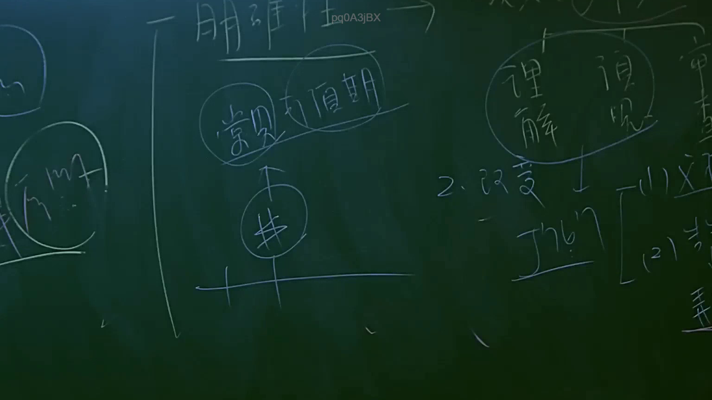
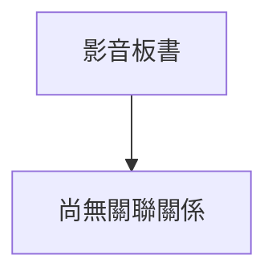

# 🎥 影音教材板書校對筆記
- **來源影片**: [預約 2 2025-07-22 20-44-57-125](file:///J://行政法A/ch2/預約 2 2025-07-22 20-44-57-125.mp4)
- **課程分類**: `[行政法A`
- **課堂章節**: `ch2]`
- **影片時間戳記**: `00:59:15` (3555 秒)
- **板書類型**: `關係圖/邏輯圖板書`
- **偵測時間**: 2026-07-13 11:40:12

## 🔍 擷取黑板板書對照圖

## 🧠 AI 智慧理解與知識庫演化註記
：

您好，您的訊息中「擷取區域的 OCR 辨識字元」部分為空白，未實際提供任何文字內容。因此我無法進行以下工作：

1. **語意整理** — 無辨識字元可分析
2. **條文比對**（如民法第184條侵權行為、消滅時效等）— 無具體法律概念可供對位
3. **Mermaid 圖表生成** — 無法從空資料建構關係圖

---

請您補充以下任一方式，我即可立即完成分析：

- **直接貼上 OCR 辨識出的文字內容**（即使有錯字或斷行也無妨）
- 或提供該時間點板書的**截圖/圖片**，我可自行進行 OCR 辨識後再作分析

一旦取得文字資料，我將依您的要求：
1. 整理語意並對位臺灣現行法律條文（民法、訴訟法、消保法等）
2. 生成符合語法的 Mermaid.js 流程圖代碼（節點用雙引號括住）

## 📊 可編輯之 Mermaid 關係流程圖

## ✍️ 操作者手動校對修改區
<!-- 您可以直接修改上方的文字或調整 Mermaid 區塊中的節點，Obsidian 會即時重新渲染 -->
- [ ] 欄位結構與法律邏輯已校對無誤。
- **校對筆記**: 
