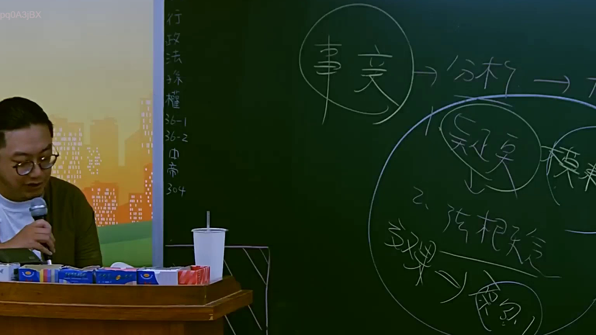
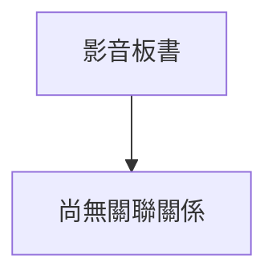

# 🎥 影音教材板書校對筆記
- **來源影片**: [預約 2 2025-07-22 20-44-57-125](file:///J://行政法A/ch2/預約 2 2025-07-22 20-44-57-125.mp4)
- **課程分類**: `[行政法A`
- **課堂章節**: `ch2]`
- **影片時間戳記**: `01:00:45` (3645 秒)
- **板書類型**: `關係圖/邏輯圖板書`
- **偵測時間**: 2026-07-13 11:40:35

## 🔍 擷取黑板板書對照圖

## 🧠 AI 智慧理解與知識庫演化註記
：

您好，感謝您的提問。不過在您的訊息中，**OCR 辨識字元區域為空白**（「擷取區域的 OCR 辨識字元如下：」之後沒有實際文字內容）。

由於缺乏具體的板書文字，我無法進行以下工作：
1. 語意整理與條文比對（如民法第184條侵權行為、消滅時效等）
2. 生成對應的 Mermaid.js 流程圖代碼

---

**請您補充提供 OCR 辨識出的板書文字內容**，例如：

> 「甲請求乙損害賠償，須符合民法第184條第1項前段之構成要件...」

一旦收到文字，我將立即為您完成：
- 📖 **知識庫比對與理解演化註記**（條文對位、實務見解、消滅時效等）
- 📊 **Mermaid.js 流程圖代碼**（關係圖/邏輯樹結構化呈現）

期待您的補充！

## 📊 可編輯之 Mermaid 關係流程圖

## ✍️ 操作者手動校對修改區
<!-- 您可以直接修改上方的文字或調整 Mermaid 區塊中的節點，Obsidian 會即時重新渲染 -->
- [ ] 欄位結構與法律邏輯已校對無誤。
- **校對筆記**: 
