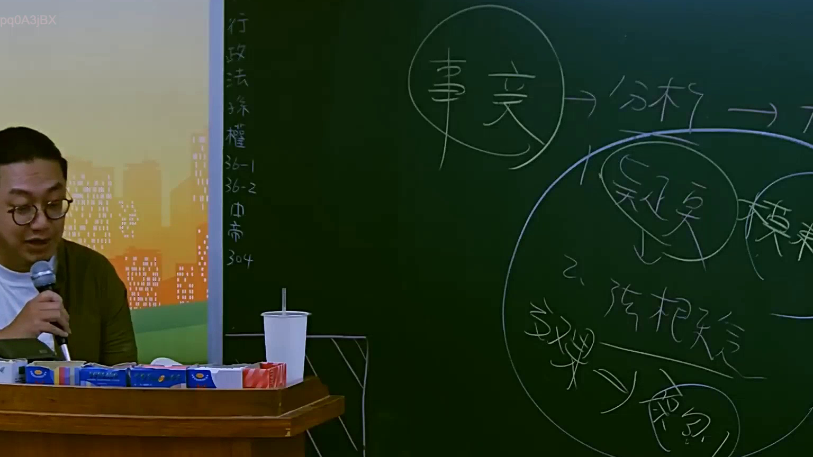
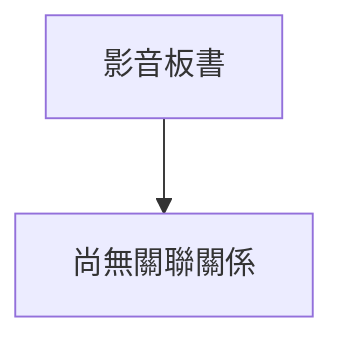

# 🎥 影音教材板書校對筆記
- **來源影片**: [預約 2 2025-07-22 20-44-57-125](file:///J://行政法A/ch2/預約 2 2025-07-22 20-44-57-125.mp4)
- **課程分類**: `[行政法A`
- **課堂章節**: `ch2]`
- **影片時間戳記**: `01:01:15` (3675 秒)
- **板書類型**: `關係圖/邏輯圖板書`
- **偵測時間**: 2026-07-13 11:40:58

## 🔍 擷取黑板板書對照圖

## 🧠 AI 智慧理解與知識庫演化註記
：

您好，您提供的訊息中「擷取區域的 OCR 辨識字元如下：」之後**未附上實際的 OCR 文字內容**。因此我無法進行以下工作：

1. **語意整理** — 無辨識文字可分析
2. **條文比對**（民法第184條、侵權行為、消滅時效等）— 無具體板書內容可對位
3. **Mermaid 圖表生成** — 無法還原老師黑板上的邏輯結構

---

請您補充以下任一方式，我即可立即處理：

- **直接貼上 OCR 辨識出的文字**（即使有錯字也無妨）
- **描述板書的大致內容**（例如：「左側寫『民法第184條』，右側畫了原告→被告的箭頭關係圖」等）

一旦收到具體資訊，我會立即完成：
- 語意整理與法律條文比對註記
- Mermaid.js 流程圖代碼（含雙引號包裹節點文字）

## 📊 可編輯之 Mermaid 關係流程圖

## ✍️ 操作者手動校對修改區
<!-- 您可以直接修改上方的文字或調整 Mermaid 區塊中的節點，Obsidian 會即時重新渲染 -->
- [ ] 欄位結構與法律邏輯已校對無誤。
- **校對筆記**: 
