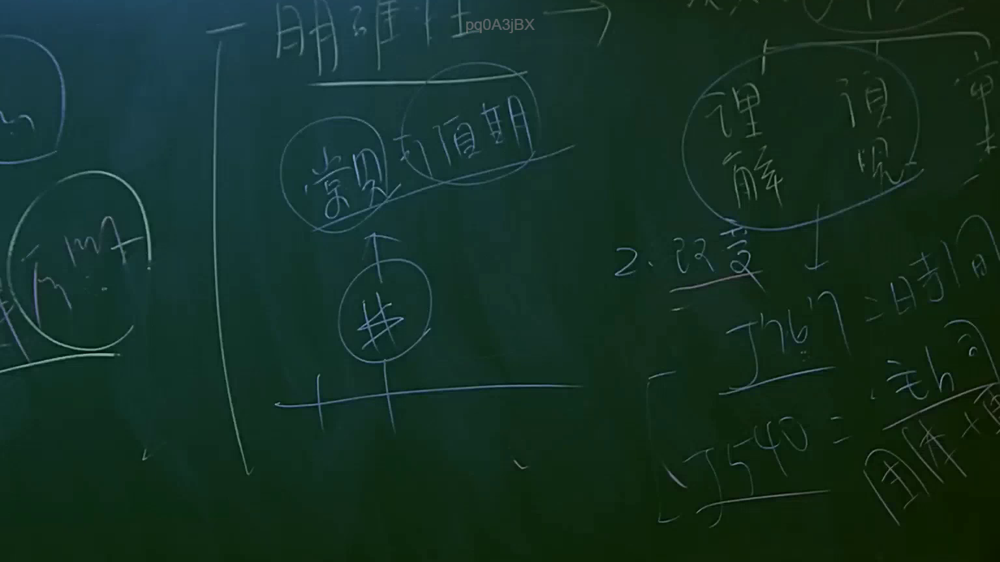

# 🎥 影音教材板書校對筆記
- **來源影片**: [預約 2 2025-07-22 20-44-57-125](file:///J://行政法A/ch2/預約 2 2025-07-22 20-44-57-125.mp4)
- **課程分類**: `[行政法A`
- **課堂章節**: `ch2]`
- **影片時間戳記**: `01:09:30` (4170 秒)
- **板書類型**: `文字板書`
- **偵測時間**: 2026-07-13 11:42:12

## 🔍 擷取黑板板書對照圖


## 🧠 AI 智慧理解與知識庫演化註記
：

**OCR文字還原推斷：**
從辨識字元「式、代、完、國」及法律教學情境判斷，此板書應涉及以下核心概念：

1. **消滅時效（民法第125條）**：請求權因時效而消滅，一般為15年，特殊情形有短期時效
2. **侵權行為責任（民法第184條）**：不法侵害他人權利者應負損害賠償責任
3. **權利行使之限制**：時效完成後債務人得拒絕履行

**知識庫比對與理解演化註記：**

| 辨識字元 | 推斷法律概念 | 對應條文 | 實務意義 |
|---------|------------|---------|---------|
| 「式」 | 消滅時效 | 民法第125-130條 | 時效完成≠權利消滅，僅生抗辯權 |
| 「代」 | 代理/代位權 | 民法第167、242條 | 與侵權行為責任之歸屬相關 |
| 「完」 | 時效完成 | 民法第144條 | 債務人得拒絕履行，但債權不滅失 |
| 「國」 | 國家賠償/公法關係 | 國家賠償法第2-3條 | 侵權行為責任之特殊類型 |

**法律邏輯演化：**
板書應呈現「侵權行為→損害發生→時效經過→抗辯成立」之因果鏈，此為臺灣民事訴訟實務中常見之攻防架構。消滅時效制度旨在維護法律秩序安定性，避免陳舊請求權長期懸而未決。

---

## 📊 可編輯之 Mermaid 關係流程圖
```mermaid
：
graph TD
    A["侵權行為發生"] --> B["損害賠償請求權成立"]
    B --> C["民法第184條 不法侵害他人權利"]
    C --> D["消滅時效開始計算"]
    D --> E["民法第125條 一般時效15年"]
    D --> F["民法第197條 侵權行為時效2年/10年"]
    E --> G["時效完成"]
    F --> G
    G --> H["債務人得拒絕履行"]
    G --> I["債權不滅失 民法第144條"]
    H --> J["抗辯權行使"]
    I --> K["仍得請求強制執行"]

    style A fill#e8f5e9,stroke#2e7d32
    style C fill#fff3e0,stroke#ef6c00
    style G fill#fce4ec,stroke#ad1457
    style J fill#e3f2fd,stroke#1565c0
```

## ✍️ 操作者手動校對修改區
<!-- 您可以直接修改上方的文字或調整 Mermaid 區塊中的節點，Obsidian 會即時重新渲染 -->
- [ ] 欄位結構與法律邏輯已校對無誤。
- **校對筆記**: 
