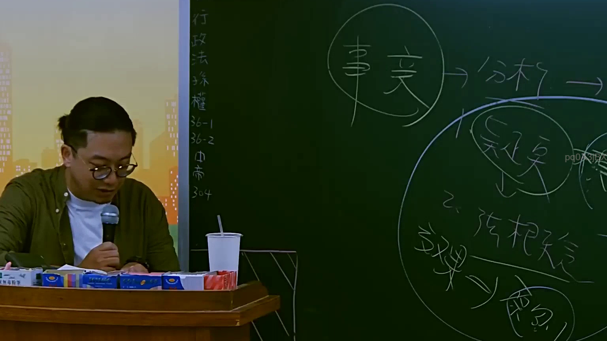
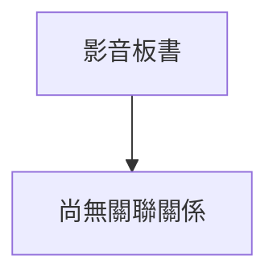

# 🎥 影音教材板書校對筆記
- **來源影片**: [預約 2 2025-07-22 20-44-57-125](file:///J://行政法A/ch2/預約 2 2025-07-22 20-44-57-125.mp4)
- **課程分類**: `[行政法A`
- **課堂章節**: `ch2]`
- **影片時間戳記**: `01:28:00` (5280 秒)
- **板書類型**: `關係圖/邏輯圖板書`
- **偵測時間**: 2026-07-13 11:42:40

## 🔍 擷取黑板板書對照圖

## 🧠 AI 智慧理解與知識庫演化註記
：

您好，您的訊息中「擷取區域的 OCR 辨識字元如下」之後**未附帶實際的文字內容**。OCR 辨識結果為空白，我無法進行後續的法律條文比對、語意整理或 Mermaid 圖表生成。

請您重新提供該時間點（88分0秒）截圖中老師板書的 OCR 文字內容，例如：
- 具體辨識出的字元/詞句
- 若有手寫符號、箭頭方向等結構資訊也一併說明

一旦收到文字資料，我將立即為您完成：
1. **知識庫比對與理解演化註記** — 對照民法第184條侵權行為責任、消滅時效（第125-131條）、或其他相關法條進行分析。
2. **Mermaid.js 流程圖代碼** — 依板書邏輯結構生成關係圖或條列式邏輯樹，節點文字以雙引號括住。

請補充 OCR 內容後再發一次，我隨時待命處理。

## 📊 可編輯之 Mermaid 關係流程圖

## ✍️ 操作者手動校對修改區
<!-- 您可以直接修改上方的文字或調整 Mermaid 區塊中的節點，Obsidian 會即時重新渲染 -->
- [ ] 欄位結構與法律邏輯已校對無誤。
- **校對筆記**: 
