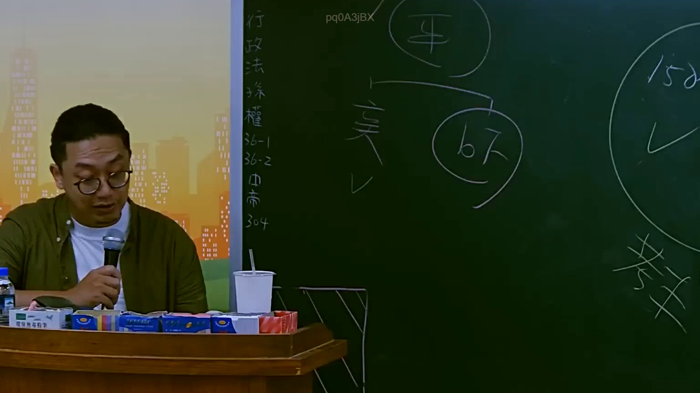
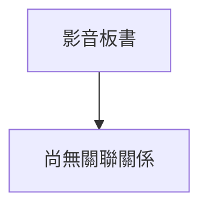

# 🎥 影音教材板書校對筆記
- **來源影片**: [預約 2 2025-07-22 20-44-57-125](file:///J://行政法A/ch2/預約 2 2025-07-22 20-44-57-125.mp4)
- **課程分類**: `[行政法A`
- **課堂章節**: `ch2]`
- **影片時間戳記**: `02:27:00` (8820 秒)
- **板書類型**: `關係圖/邏輯圖板書`
- **偵測時間**: 2026-07-13 11:43:20

## 🔍 擷取黑板板書對照圖

## 🧠 AI 智慧理解與知識庫演化註記
：

您好，您提供的訊息中「擷取區域的 OCR 辨識字元」部分為空白/未顯示。我無法進行後續的法律條文比對與 Mermaid 圖表生成。

請您補充以下任一方式之一：

1. **直接貼上 OCR 辨識出的文字內容**（例如：板書上的關鍵字、條文編號、邏輯關係詞等）
2. **描述板書的大致結構**（例如：「左側寫了民法第184條，右側畫了箭頭指向消滅時效」）

一旦收到 OCR 文字或板書內容，我將立即為您完成：

- 📚 **知識庫比對與理解演化註記** — 比對民法、侵權行為法、消滅時效等相關條文
- 🌳 **Mermaid.js 流程圖代碼** — 依板書邏輯關係生成對應的視覺化圖表（含雙引號包裹節點文字）

期待您的補充！

## 📊 可編輯之 Mermaid 關係流程圖

## ✍️ 操作者手動校對修改區
<!-- 您可以直接修改上方的文字或調整 Mermaid 區塊中的節點，Obsidian 會即時重新渲染 -->
- [ ] 欄位結構與法律邏輯已校對無誤。
- **校對筆記**: 
