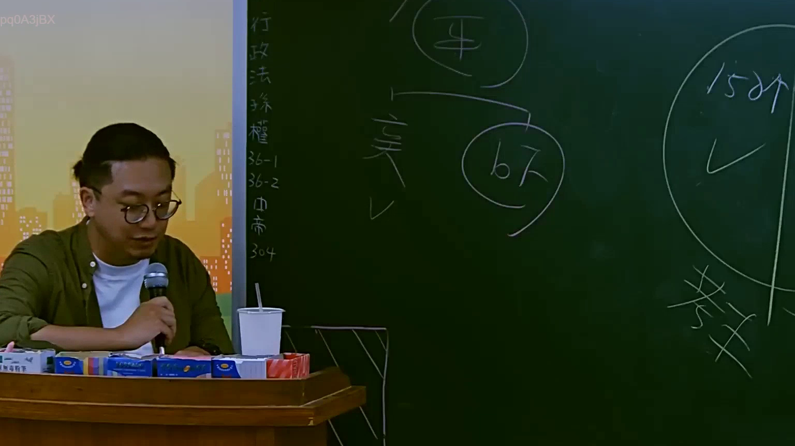
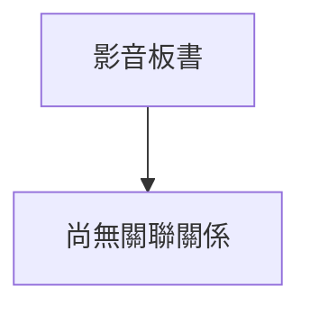

# 🎥 影音教材板書校對筆記
- **來源影片**: [預約 2 2025-07-22 20-44-57-125](file:///J://行政法A/ch2/預約 2 2025-07-22 20-44-57-125.mp4)
- **課程分類**: `[行政法A`
- **課堂章節**: `ch2]`
- **影片時間戳記**: `02:39:00` (9540 秒)
- **板書類型**: `關係圖/邏輯圖板書`
- **偵測時間**: 2026-07-13 11:43:46

## 🔍 擷取黑板板書對照圖

## 🧠 AI 智慧理解與知識庫演化註記
：
您好，您提供的訊息中「擷取區域的 OCR 辨識字元」部分為空白，未實際顯示任何文字內容。因此我無法進行以下工作：

1. **語意整理** — 無辨識文字可供分析
2. **條文比對**（民法第184條、侵權行為、消滅時效等）— 無具體法律概念可對位
3. **Mermaid.js 流程圖生成** — 無結構資訊可繪製

請您補充以下任一方式，我即可立即協助：

- 📋 **直接貼上 OCR 辨識出的文字內容**（即使有錯字我也能修正）
- 🔗 **提供截圖或描述板書上的具體文字與邏輯關係**
- 🎯 **告知老師當時講授的主題方向**（例如：侵權行為責任構成要件、契約效力、消滅時效起算等），我可先預擬分析框架

一旦收到辨識文字，我將立即完成：
✅ 語意整理與法律條文比對註記  
✅ Mermaid.js 流程圖代碼生成（含雙引號節點格式）  

期待您的補充！

## 📊 可編輯之 Mermaid 關係流程圖

## ✍️ 操作者手動校對修改區
<!-- 您可以直接修改上方的文字或調整 Mermaid 區塊中的節點，Obsidian 會即時重新渲染 -->
- [ ] 欄位結構與法律邏輯已校對無誤。
- **校對筆記**: 
