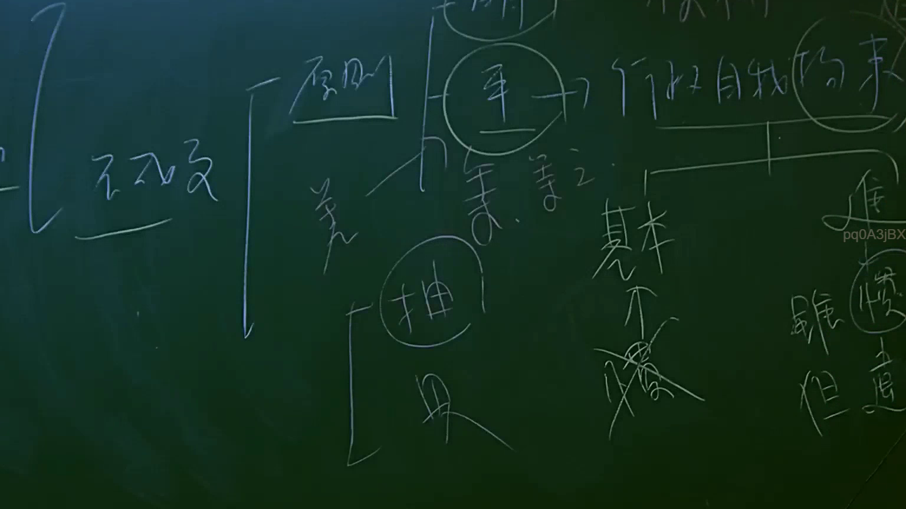
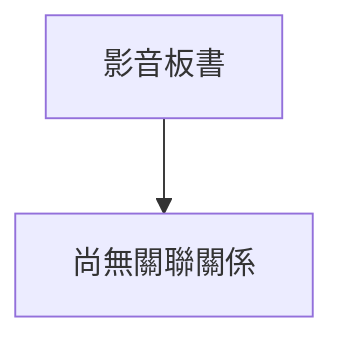

# 🎥 影音教材板書校對筆記
- **來源影片**: [預約 2 2025-07-22 20-44-57-125](file:///J://行政法A/ch2/預約 2 2025-07-22 20-44-57-125.mp4)
- **課程分類**: `[行政法A`
- **課堂章節**: `ch2]`
- **影片時間戳記**: `02:41:15` (9675 秒)
- **板書類型**: `關係圖/邏輯圖板書`
- **偵測時間**: 2026-07-13 11:44:04

## 🔍 擷取黑板板書對照圖

## 🧠 AI 智慧理解與知識庫演化註記
：
您提供的訊息中，「擷取區域的 OCR 辨識字元」部分為空白，未實際附上任何文字內容。因此我無法進行以下工作：

1. **語意整理** — 無辨識字元可供分析。
2. **條文比對**（如民法第184條侵權行為、消滅時效等）— 無具體法律概念可對位。
3. **Mermaid.js 流程圖生成** — 無法判斷板書結構與邏輯關係。

---

請您補充以下任一方式，我即可立即完成分析：

- **直接貼上 OCR 辨識出的文字內容**（即使有錯字也無妨）。
- **描述老師當時在黑板上所寫的內容或繪製的圖表結構**。

一旦收到資料，我會依您的要求輸出完整的「解讀與註記」及對應的 Mermaid.js 代碼。

## 📊 可編輯之 Mermaid 關係流程圖

## ✍️ 操作者手動校對修改區
<!-- 您可以直接修改上方的文字或調整 Mermaid 區塊中的節點，Obsidian 會即時重新渲染 -->
- [ ] 欄位結構與法律邏輯已校對無誤。
- **校對筆記**: 
