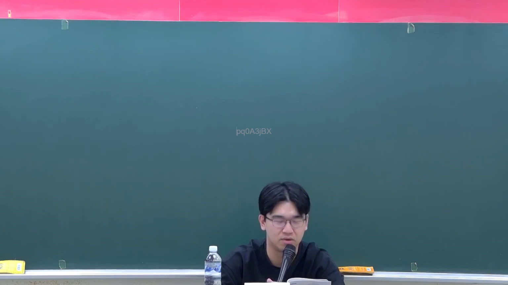
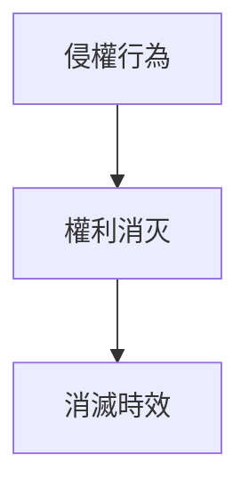

# 🎥 影音教材板書校對筆記
- **來源影片**: [預約 2 2025-10-04 22-45-59-893](file:///H:/憲法霖洄/ch2/預約 2 2025-10-04 22-45-59-893.mp4)
- **課程分類**: `預設課程`
- **課堂章節**: `ch2`
- **影片時間戳記**: `00:07:45` (465 秒)
- **板書類型**: `關係圖/邏輯圖板書`
- **偵測時間**: 2026-07-13 19:54:50

## 🔍 擷取黑板板書對照圖


## 🧠 AI 智慧理解與知識庫演化註記
### 

根據OCR文字內容，板書似乎涉及「侵權行為」、「權利消灭」和「消滅時效」（perpetual succession）的關係。以下是基於现有信息的整理與分析：

1. **侵權行為**： board上可能写着「侵權行為」，表示侵害他人權益的行为。
2. **權利消灭**： board上可能写着「權利消灭」，表示因侵權行为导致權利被消除。
3. **消滅時效**： board上可能写着「消滅時效」，表示權利在特定条件下不会消灭的概念。

以下是與此內容相關的臺灣現行法律條文比對：

- **民法第184條**： 有关侵害他人權益的行為，以及權利消灭的問題。
- **侵權行為**： 民法第184條规定，侵害他人權益的行为会消除其權益。
- **消滅時效**： 消滅時效是民法中的一种保护机制，确保在特定条件下权利不会消灭。

###

## 📊 可編輯之 Mermaid 關係流程圖

此图为 board上可能展示的結構，表示侵權行为導致權利消灭，而權利消灭又進一步保障了消滅時效的持續性。
```

## ✍️ 操作者手動校對修改區
<!-- 您可以直接修改上方的文字或調整 Mermaid 區塊中的節點，Obsidian 會即時重新渲染 -->
- [ ] 欄位結構與法律邏輯已校對無誤。
- **校對筆記**: 
