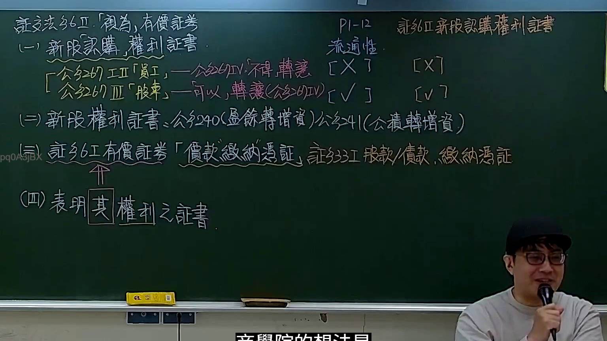

# 🎥 影音教材板書校對筆記
- **來源影片**: [預約 2 2026-04-26 18-22-55-635](file:///J://證交法B115/ch2/預約 2 2026-04-26 18-22-55-635.mp4)
- **課程分類**: `[證交法B115`
- **課堂章節**: `ch2]`
- **影片時間戳記**: `00:58:15` (3495 秒)
- **板書類型**: `影音板書`
- **偵測時間**: 2026-07-10 01:05:46

## 🔍 擷取黑板板書對照圖


## 🧠 AI 智慧理解與知識庫演化註記
：

本次板書的內容主要聚焦於臺灣《證券交易法》和《公司法》中關於「有價證券」的定義、種類，特別是「新股認購權利證書」與「價款繳納憑證」的法律地位與流通性。

**板書文字辨識與解讀：**

1.  **「證交法 36 II 「視為」有價證券」 / 「P1-12 證交法 36 II 新股認購權利證書」**
    *   **辨識：** 證交法 36 II 「視為」有價證券。P1-12 證交法 36 II 新股認購權利證書。
    *   **解讀：** 這裡的「證交法 36 II」很可能是老師上課時的章節或頁碼標示，而非直接引用《證券交易法》第 36 條第 2 項的內容。依據現行《證券交易法》第 36 條第 2 項是關於財務報告編製準則的規定，與有價證券的「視為」或「新股認購權利證書」無關。
    *   **法條對照與註記：**
        *   在臺灣《證券交易法》中，明確將「新股認購權利證書」列為有價證券的條文是**第 6 條第 1 項**。該條規定：「本法所稱有價證券，指政府債券、公司股票、公司債券、受益憑證、資產基礎證券、認購（售）權證、股權性質金融商品、**新股認購權利證書**、新股權利證書、債券換股權利證書、其他經主管機關核定之有價證券及前開有價證券之價款繳納憑證。」
        *   因此，板書中的「視為」可能是在教學上強調其法律地位，或指其雖非傳統股票，但被法律賦予有價證券的地位。但就法條而言，新股認購權利證書是**直接被定義**為有價證券，而非「視為」。

2.  **「(一) 新股認購權利證書．」**
    *   **辨識：** (一) 新股認購權利證書．
    *   **解讀：** 這是本次課程討論的核心客體。新股認購權利證書賦予持有人在特定條件下認購公司新發行股份的權利。

3.  **「公司法 267 II 員工，一公司法 267 IV 「不得」轉讓 [X]」**
    *   **辨識：** 「公司法 267 II 員工，一公司法 267 IV 「不得」轉讓 [X]
    *   **解讀：** 依據《公司法》第 267 條第 2 項，公司發行新股時，應保留部分股份供員工承購。而第 4 項則規定，依第 1 項及第 2 項規定保留供員工認購之股份，員工自繳款之日起未滿二年者，**不得轉讓**。雖然條文是限制股份轉讓，但通常員工所持有的認購權利證書也同樣受此限制，以達員工激勵及留任的目的，避免員工短期套利。板書中的 "[X]" 符號明確指出其不可轉讓性。

4.  **「公司法 267 III 股東」—「可以」轉讓 (公司法 267 IV) [V]」**
    *   **辨識：** 「公司法 267 III 股東」—「可以」轉讓 (公司法 267 IV) [V]
    *   **解讀：** 依據《公司法》第 267 條第 3 項，公司發行新股時，除員工保留部分外，應公告並通知原有股東按其原有股份比例優先認購。由於第 4 項的轉讓限制僅針對員工認購的股份，因此對於原有股東取得的新股認購權利證書，法律並未限制其轉讓，股東可以將其權利證書轉讓給他人。板書中的 "[V]" 符號表示其可轉讓性。
    *   **右側「流通性」：** 右側的「流通性」與左側的 [X] 和 [V] 符號對應，進一步說明了員工認購權利證書不具流通性，而股東認購權利證書則具備流通性。

5.  **「(二) 新股權利證書：公司法 240 (盈餘轉增資) / 公司法 241 (公積轉增資)」**
    *   **辨識：** (二) 新股權利證書：公司法 240 (盈餘轉增資) / 公司法 241 (公積轉增資)
    *   **解讀：** 這部分說明了另一種「新股權利證書」的來源。
        *   《公司法》第 240 條規定公司可以將「盈餘」轉作資本發行新股 (盈餘轉增資)，分配給原有股東。
        *   《公司法》第 241 條規定公司可以將「資本公積」轉作資本發行新股 (公積轉增資)，分配給原有股東。
    *   這些情況下，在股票尚未實質發放前，可能也會發行「新股權利證書」以表彰股東取得新股的權利。這些證書亦屬於《證券交易法》第 6 條第 1 項所稱之「有價證券」。

6.  **「(三) 證交法 6 I 有價證券 「價款繳納憑證」 ↑ 證 333 I 股款/債款 繳納憑證」**
    *   **辨識：** (三) 證交法 6 I 有價證券 「價款繳納憑證」 ↑ 證 333 I 股款/債款 繳納憑證
    *   **解讀：** 這裡明確指出《證券交易法》第 6 條第 1 項將「價款繳納憑證」列為有價證券。所謂價款繳納憑證，是指證明已繳納認購股票或債券款項的證明文件。此憑證在法律上被賦予有價證券的地位，意味著其流通、交易等行為會受到《證券交易法》的規範。
    *   「證 333 I 股款/債款 繳納憑證」指的是《證券交易法》第 333 條第 1 項，該條文主要規範對於有價證券價款繳納憑證之偽造、變造、背書或轉讓等犯罪行為，強調了此類憑證在交易安全上的重要性。

7.  **「(四) 表明 [其] 權利之證書.」**
    *   **辨識：** (四) 表明 [其] 權利之證書.
    *   **解讀：** 這是對「權利證書」的一個概括性定義，強調其本質是作為證明或表彰特定權利的文件。這裡特別框選「其」字，可能旨在強調證書本身即是權利的載體，其法律效力與所表彰的權利緊密連結。

**總結而言，** 板書內容清晰地呈現了《證券交易法》下有價證券的多元性與特殊性，尤其是對新股認購權利證書依發行對象（員工或股東）在流通性上的差異進行了比較，並闡明了盈餘或公積轉增資下新股權利證書的由來，以及價款繳納憑證作為有價證券的法律地位。這些都是理解臺灣證券市場運作與投資人保護的基礎知識。

## 📊 可編輯之 Mermaid 關係流程圖
```mermaid
：
graph TD
    A["證交法 36 II - 課程討論主題"]
    A --> B["新股認購權利證書 (Securities Exchange Act Article 6 Paragraph 1)"];
    B -- "在證交法下被" --> C["「視為」有價證券"];

    subgraph "有價證券類型與特性 (Securities Exchange Act Article 6 Paragraph 1)"
        C --> D1["(一) 新股認購權利證書"];
        D1 --> E1["發行對象 公司法 267 II 員工"];
        E1 -- "轉讓限制" --> F1["不得轉讓 [X]"];
        F1 --> G1["流通性 否"];
        D1 --> E2["發行對象 公司法 267 III 股東"];
        E2 -- "轉讓許可" --> F2["可以轉讓 (公司法 267 IV) [V]"];
        F2 --> G2["流通性 是"];
        
        C --> D2["(二) 新股權利證書"];
        D2 --> H1["來源 公司法 240 (盈餘轉增資)"];
        D2 --> H2["來源 公司法 241 (公積轉增資)"];
        
        C --> D3["(三) 價款繳納憑證"];
        D3 --> I1["依 證交法 6 I 列為有價證券"];
        D3 --> I2["相關條文 證交法 333 I 股款/債款 繳納憑證"];
    end

    J["(四) 表明 [其] 權利之證書"] --> K["權利證書之本質定義"];
```

## ✍️ 操作者手動校對修改區
<!-- 您可以直接修改上方的文字或調整 Mermaid 區塊中的節點，Obsidian 會即時重新渲染 -->
- [ ] 欄位結構與法律邏輯已校對無誤。
- **校對筆記**: 
