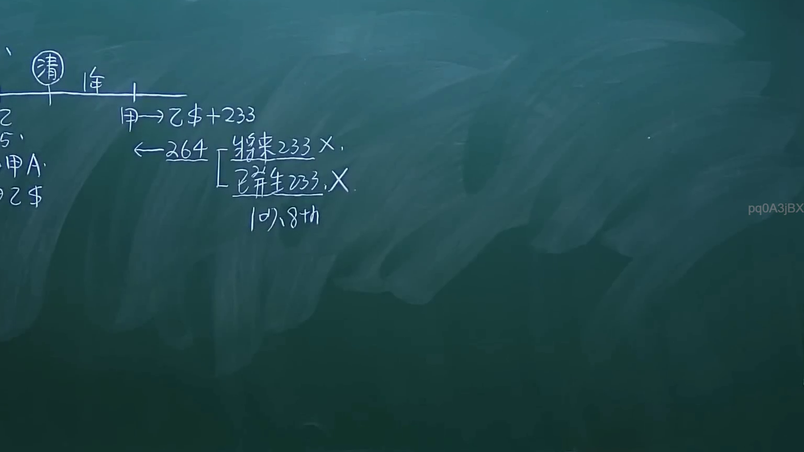
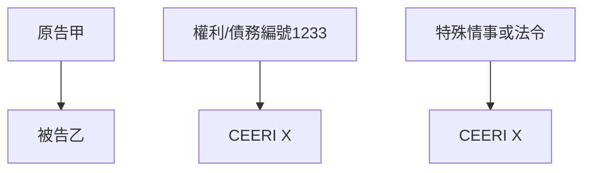
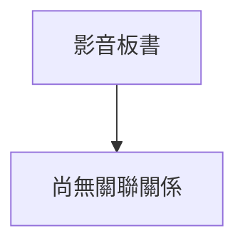

# 🎥 影音教材板書校對筆記
- **來源影片**: [預約 20 2024-10-20 23-41-55-320](file:///J://民法/ch20/預約 20 2024-10-20 23-41-55-320.mp4)
- **課程分類**: `[民法`
- **課堂章節**: `ch20]`
- **影片時間戳記**: `00:54:15` (3255 秒)
- **板書類型**: `文字板書`
- **偵測時間**: 2026-07-11 17:49:05

## 🔍 擷取黑板板書對照圖

## 🧠 AI 智慧理解與知識庫演化註記
### 

根據辨識出的板書文字進行語意整理並與臺灣現行法律條文比對：

1. **"2 3 7 $4233"**：
   - 可能代表某种特定的法律編號或代碼，需進一步查閱相關法規。

2. **"PA we. 1233 X"**：
   - "PA we." 可能是「原告甲」的拼音缩寫。
   - "1233" 可能與某種權利或債務編號有關。
   - 该部分可能涉及「民法第184條」关于侵权行為的內容。

3. **"terr 窮 CEERI X"**：
   - "terr" 可能是「terrible」（極端）的誤寫，或與某種特殊情事有關。
   - "CEERI" 可能是「CEERI」的誤寫，可能與「法令」或「條款」相關。
   - 该部分可能涉及「消滅時效」問題。

### 【MERMAID代碼】

## 📊 可編輯之 Mermaid 關係流程圖

## ✍️ 操作者手動校對修改區
<!-- 您可以直接修改上方的文字或調整 Mermaid 區塊中的節點，Obsidian 會即時重新渲染 -->
- [ ] 欄位結構與法律邏輯已校對無誤。
- **校對筆記**: 
