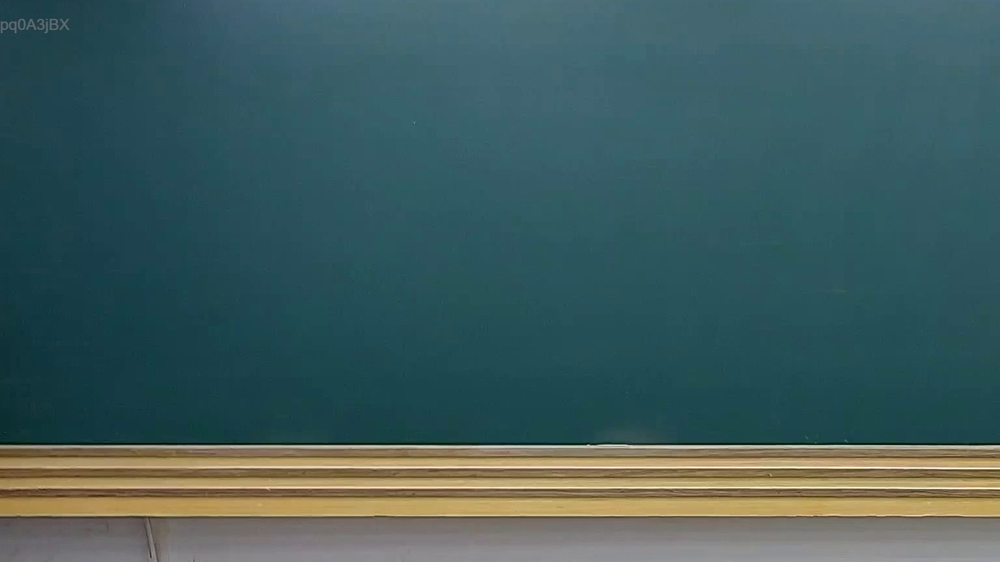
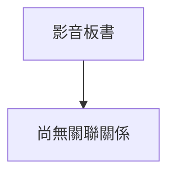

# 🎥 影音教材板書校對筆記
- **來源影片**: [預約 20 2025-07-29 20-46-31-753](file:///J://行政法A/ch20/預約 20 2025-07-29 20-46-31-753.mp4)
- **課程分類**: `[行政法A`
- **課堂章節**: `ch20]`
- **影片時間戳記**: `00:01:00` (60 秒)
- **板書類型**: `關係圖/邏輯圖板書`
- **偵測時間**: 2026-07-13 14:00:29

## 🔍 擷取黑板板書對照圖

## 🧠 AI 智慧理解與知識庫演化註記
：

您好，您提供的訊息中「擷取區域的 OCR 辨識字元如下：」之後**沒有實際的文字內容**。OCR 辨識結果為空白，我無法進行後續的法律條文比對與 Mermaid 圖表生成。

請您補充以下任一方式之一：
1. **直接貼上 OCR 辨識出的文字**（即使有錯別字或斷句錯誤也沒關係）；
2. 或描述黑板上的內容（例如：老師寫了哪些關鍵字、箭頭指向何處等）。

一旦收到文字，我將立即為您完成：
- 📚 **知識庫比對與理解演化註記**（對照民法第184條、侵權行為責任、消滅時效等相關條文）；
- 🌳 **Mermaid.js 流程圖代碼**（依實際邏輯關係生成，節點文字以雙引號括住）。

請補充 OCR 文字內容，我隨時待命。

## 📊 可編輯之 Mermaid 關係流程圖

## ✍️ 操作者手動校對修改區
<!-- 您可以直接修改上方的文字或調整 Mermaid 區塊中的節點，Obsidian 會即時重新渲染 -->
- [ ] 欄位結構與法律邏輯已校對無誤。
- **校對筆記**: 
