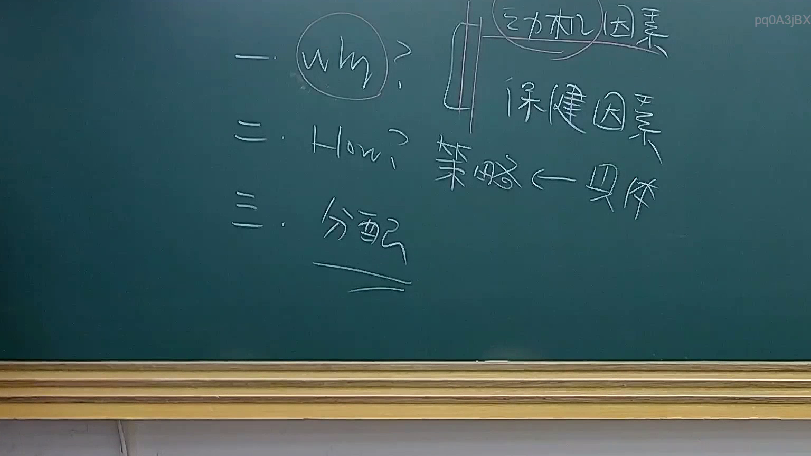

# 🎥 影音教材板書校對筆記
- **來源影片**: [預約 20 2025-07-29 20-46-31-753](file:///J://行政法A/ch20/預約 20 2025-07-29 20-46-31-753.mp4)
- **課程分類**: `[行政法A`
- **課堂章節**: `ch20]`
- **影片時間戳記**: `00:17:45` (1065 秒)
- **板書類型**: `關係圖/邏輯圖板書`
- **偵測時間**: 2026-07-13 14:00:53

## 🔍 擷取黑板板書對照圖


## 🧠 AI 智慧理解與知識庫演化註記
您好！我注意到您提供的訊息中，**OCR 辨識字元區域是空的**（「擷取區域的 OCR 辨識字元如下：」之後沒有文字）。

為了能正確完成以下工作：

1. **語意整理與法律條文比對**（如民法第184條、侵權行為、消滅時效等）
2. **生成 Mermaid.js 關係圖/邏輯圖代碼**

請您將老師黑板上的 OCR 辨識文字貼上，我才能進行後續分析。

例如，您可以這樣提供：
> 「甲請求乙賠償新臺幣100萬元...」或任何辨識出的字元內容

一旦收到文字，我會立即為您完成與

## 📊 可編輯之 Mermaid 關係流程圖
```mermaid
的輸出。
```

## ✍️ 操作者手動校對修改區
<!-- 您可以直接修改上方的文字或調整 Mermaid 區塊中的節點，Obsidian 會即時重新渲染 -->
- [ ] 欄位結構與法律邏輯已校對無誤。
- **校對筆記**: 
