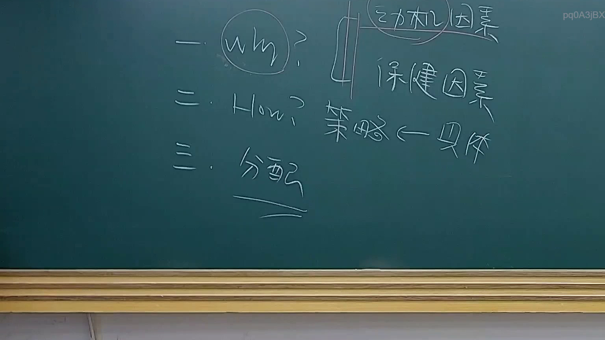
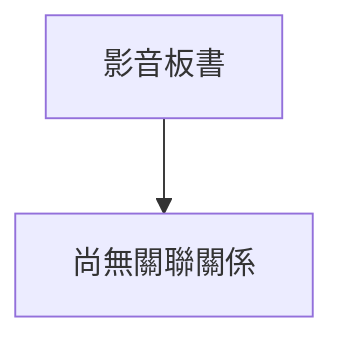

# 🎥 影音教材板書校對筆記
- **來源影片**: [預約 20 2025-07-29 20-46-31-753](file:///J://行政法A/ch20/預約 20 2025-07-29 20-46-31-753.mp4)
- **課程分類**: `[行政法A`
- **課堂章節**: `ch20]`
- **影片時間戳記**: `00:19:00` (1140 秒)
- **板書類型**: `關係圖/邏輯圖板書`
- **偵測時間**: 2026-07-13 14:01:17

## 🔍 擷取黑板板書對照圖

## 🧠 AI 智慧理解與知識庫演化註記
：

您好！您的訊息中「擷取區域的 OCR 辨識字元」部分**文字為空**，未實際提供任何辨識結果。因此我無法進行語意整理、條文比對或生成 Mermaid 圖表。

請您將老師黑板上的 OCR 辨識文字重新貼上，例如：

> 「侵權行為之構成要件：故意或過失 → 不法行為 → 損害發生 → 因果關係」

一旦收到文字內容，我將立即為您完成以下工作：

1. **語意整理** — 釐清板書邏輯結構
2. **條文比對註記** — 與民法第184條、侵權行為責任、消滅時效等現行法條進行對位分析
3. **Mermaid.js 流程圖代碼** — 依分類（關係圖/邏輯圖 or 文字板書）生成對應的 Mermaid 語法，節點文字以雙引號括住

請補充 OCR 辨識字元後再發一次，我馬上為您處理！

## 📊 可編輯之 Mermaid 關係流程圖

## ✍️ 操作者手動校對修改區
<!-- 您可以直接修改上方的文字或調整 Mermaid 區塊中的節點，Obsidian 會即時重新渲染 -->
- [ ] 欄位結構與法律邏輯已校對無誤。
- **校對筆記**: 
