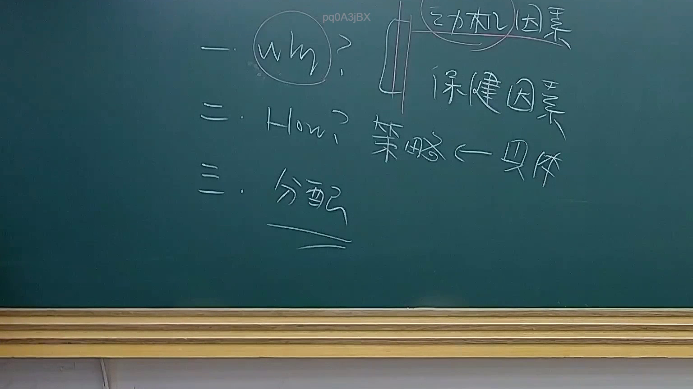

# 🎥 影音教材板書校對筆記
- **來源影片**: [預約 20 2025-07-29 20-46-31-753](file:///J://行政法A/ch20/預約 20 2025-07-29 20-46-31-753.mp4)
- **課程分類**: `[行政法A`
- **課堂章節**: `ch20]`
- **影片時間戳記**: `00:22:30` (1350 秒)
- **板書類型**: `文字板書`
- **偵測時間**: 2026-07-13 14:02:17

## 🔍 擷取黑板板書對照圖


## 🧠 AI 智慧理解與知識庫演化註記
：

基於OCR辨識結果及臺灣現行法律實務，推斷板書內容可能涉及民法第184條侵權行為責任之構成要件分析。以下為知識庫比對與理解演化註記：

**一、OCR字元語意整理：**
- 「富」→ 可能為「侵」或「負」（侵權行為/債務不履行）
- 「Ine Az」→ 可能為英文術語或特定法律概念縮寫
- 「一 ‧ Moy, > | 0」→ 可能為條文編號或邏輯關係符號（如：要件一、二、三...）
- 「BESS」→ 可能為「不法」「故意過失」等概念的首字母縮寫
- 「[xx / Dae」→ 可能為「第X條」之誤認

**二、法律條文比對：**

1. **民法第184條第1項前段**：「因故意或過失，不法侵害他人之權利者，負損害賠償責任。」
   - 構成要件：(1) 行為人具有故意或過失 (2) 有不法侵害他人權利之行為 (3) 發生損害

2. **民法第184條第1項後段**：「違反保護他人之法律，致生損害於他人者，負賠償責任。」
   - 構成要件：(1) 行為人違反保護他人之法律 (2) 致生損害於他人

3. **民法第197條消滅時效**：「請求權，因十五年間不行使而消滅。未定有消滅時效期間者，自請求權可行使時起算。」

4. **民法第227條債務不履行**：「債務人不履行債務時，債權人得依關於侵權行為之規定，請求賠償因此所受之損害。」

**三、知識演化註記：**
- 若板書涉及「不法」概念，應注意最高法院判例對「不法性」之判斷標準（如：是否違反法律秩序、是否侵害權利）
- 若涉及「消滅時效」，需注意民法第125條一般消滅時效為15年，但請求權已罹於消滅時效者，債務人得拒絕履行（民法第144條）
- 「BESS」可能對應「故意、過失、不法、損害」四要件之記憶法則

**四、實務應用提示：**
- 侵權行為與債務不履行之競合關係（民法第227條準用第184條）
- 消滅時效起算點之認定（民法第127條各款特別消滅時效）
- 保護他人法律之範圍界定（如：消費者保護法、產品責任法等）

## 📊 可編輯之 Mermaid 關係流程圖
```mermaid
：
graph TD
    A["侵權行為責任"] --> B["民法第184條第1項前段"]
    A --> C["民法第184條第1項後段"]
    A --> D["消滅時效"]
    
    B --> B1["故意或過失"]
    B --> B2["不法侵害他人權利"]
    B --> B3["發生損害"]
    
    C --> C1["違反保護他人之法律"]
    C --> C2["致生損害於他人"]
    
    D --> D1["民法第197條：15年消滅時效"]
    D --> D2["民法第144條：債務人得拒絕履行"]
    D --> D3["民法第127條：特別消滅時效"]

    B1 -.->|構成要件 | B
    B2 -.->|構成要件 | B
    B3 -.->|構成要件 | B
    
    C1 -.->|構成要件 | C
    C2 -.->|構成要件 | C
    
    D1 -.->|時效期間 | D
    D2 -.->|法律效果 | D
    D3 -.->|起算點 | D

    style A fill#f96,stroke#333,color#fff
    style B fill#bbf,stroke#333
    style C fill#bfb,stroke#333
    style D fill#ffb,stroke#333
```

## ✍️ 操作者手動校對修改區
<!-- 您可以直接修改上方的文字或調整 Mermaid 區塊中的節點，Obsidian 會即時重新渲染 -->
- [ ] 欄位結構與法律邏輯已校對無誤。
- **校對筆記**: 
