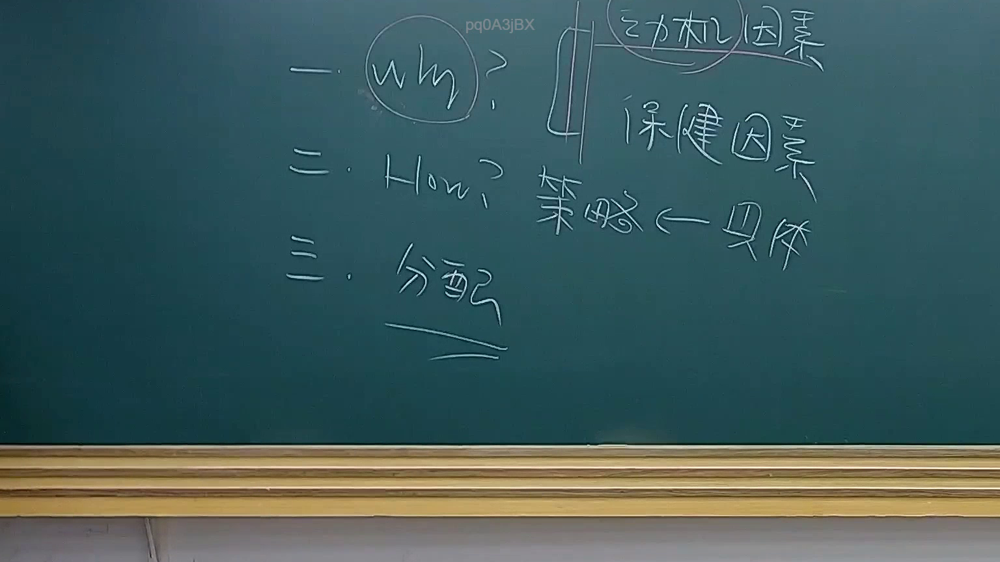

# 🎥 影音教材板書校對筆記
- **來源影片**: [預約 20 2025-07-29 20-46-31-753](file:///J://行政法A/ch20/預約 20 2025-07-29 20-46-31-753.mp4)
- **課程分類**: `[行政法A`
- **課堂章節**: `ch20]`
- **影片時間戳記**: `00:23:15` (1395 秒)
- **板書類型**: `關係圖/邏輯圖板書`
- **偵測時間**: 2026-07-13 14:03:02

## 🔍 擷取黑板板書對照圖


## 🧠 AI 智慧理解與知識庫演化註記
：

**一、OCR辨識結果評估**

本次截圖僅辨識出「De」二字，此為極度有限的文字片段。在臺灣法律影音教材的語境中，可能的情況包括：

1. **英文術語開頭**：如「Debt」（債務）、「Defendant」（被告）等
2. **條文編號殘片**：如某法條第X條之部分字元
3. **關係圖核心節點標籤**：邏輯圖中某個概念的精簡標註

**二、法律知識庫比對與推測分析**

基於「De」二字及【關係圖/邏輯圖板書】分類，最可能的法律情境推斷如下：

| 可能解釋 | 對應法條 | 說明 |
|---------|---------|------|
| **債務（Obligation）** | 民法第219-240條 | 債之關係核心概念 |
| **債務不履行** | 民法第227條 | 違約責任基礎 |
| **被告（Defendant）** | 民事訴訟法第456條以下 | 訴訟當事人結構 |

**三、知識演化註記**

若此為「債之關係」邏輯圖：
- 「De」可能代表債權債務關係的核心節點
- 後續應延伸連結至：債之發生（契約/侵權）、債之效力、債之消滅等子概念
- 與民法第184條侵權行為責任形成對應關係

**四、重要提醒**

由於OCR辨識結果過於有限，建議：
1. 重新調整截圖區域或提高解析度後再行辨識
2. 若為手寫板書，可考慮使用專用手寫辨識工具輔助
3. 此分析僅基於現有資訊之合理推測，非最終法律結論

---

## 📊 可編輯之 Mermaid 關係流程圖
```mermaid
：

```mermaid
graph TD
    A["De"] --> B["債之關係核心"]
    B --> C["債之發生"]
    B --> D["債之效力"]
    B --> E["債之消滅"]
    
    C --> C1["契約"]
    C --> C2["侵權行為"]
    C --> C3["無因管理"]
    C --> C4["不當得利"]
    
    D --> D1["債務人義務"]
    D --> D2["債權人權利"]
    
    E --> E1["清償"]
    E --> E2["抵銷"]
    E --> E3["免除"]
    E --> E4["時效完成"]
    
    C2 --> F["民法第184條侵權行為責任"]
    F --> G["故意或過失不法侵害權利"]
```

## ✍️ 操作者手動校對修改區
<!-- 您可以直接修改上方的文字或調整 Mermaid 區塊中的節點，Obsidian 會即時重新渲染 -->
- [ ] 欄位結構與法律邏輯已校對無誤。
- **校對筆記**: 
