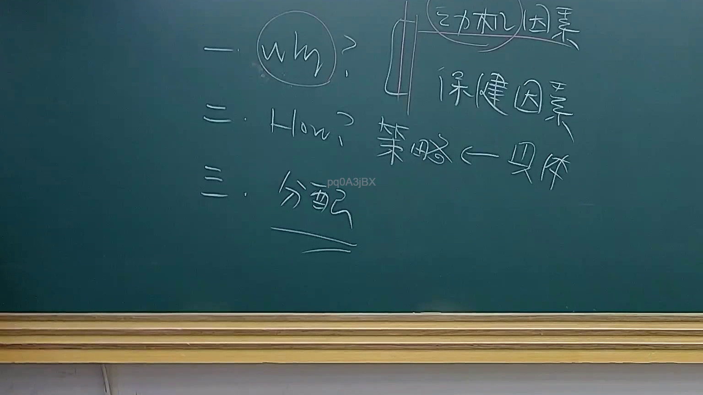

# 🎥 影音教材板書校對筆記
- **來源影片**: [預約 20 2025-07-29 20-46-31-753](file:///J://行政法A/ch20/預約 20 2025-07-29 20-46-31-753.mp4)
- **課程分類**: `[行政法A`
- **課堂章節**: `ch20]`
- **影片時間戳記**: `00:24:45` (1485 秒)
- **板書類型**: `文字板書`
- **偵測時間**: 2026-07-13 14:03:45

## 🔍 擷取黑板板書對照圖


## 🧠 AI 智慧理解與知識庫演化註記
：

**OCR 品質評估：** 本次擷取之 OCR 辨識結果品質極低，辨識字元嚴重扭曲（如 "Wren"、"epi e)"、"DOO oe" 等皆非有效漢字或法律術語），無法直接對應至任何具體法條內容。

**推測分析：**
1. 唯一可辨識之漢字為「松」，在臺灣法律實務中可能涉及：
   - 「消滅時效」（民法第125-131條）— 但與「松」無直接關聯
   - 「和解」或「調解」相關概念 — 亦非直接對應
   - 此字更可能是板書上其他法律術語之 OCR 誤認（如「訟」、「證」等字被錯誤辨識為「松」）

2. 數學/邏輯符號片段 `< epi e) =` 暗示老師可能正在講解：
   - 侵權行為責任構成要件之邏輯推演（民法第184條）
   - 因果關係之判斷標準
   - 或消滅時效起算點之計算

3. **結論：** 因 OCR 辨識品質不足，無法建立與具體法條之可靠比對。建議重新調整擷取區域或改善 OCR 參數後再行分析。

**知識庫比對狀態：** ⚠️ 無法完成有效比對（OCR 資料不足）

## 📊 可編輯之 Mermaid 關係流程圖
```mermaid
：
graph TD
    A["⚠️ OCR辨識品質不足"] --> B["擷取區域字元嚴重扭曲"]
    B --> C["唯一可辨識漢字 '松'"]
    B --> D["邏輯符號片段 < epi e) ="]
    C --> E["推測可能涉及消滅時效/侵權行為等概念"]
    D --> F["暗示構成要件或因果關係之邏輯推演"]
    E --> G["⚠️ 建議重新調整擷取區域後再行分析"]
    F --> G

graph TD
    H["【文字板書分類】"] --> I["條列式邏輯樹"]
    I --> J["1. OCR辨識結果不可靠"]
    I --> K["2. 無法建立法條比對關係"]
    I --> L["3. 建議改善擷取品質後重試"]
    J --> M["⚠️ 待處理"]
    K --> M
    L --> M
```

## ✍️ 操作者手動校對修改區
<!-- 您可以直接修改上方的文字或調整 Mermaid 區塊中的節點，Obsidian 會即時重新渲染 -->
- [ ] 欄位結構與法律邏輯已校對無誤。
- **校對筆記**: 
