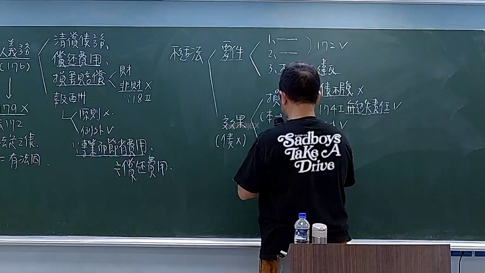

# 🎥 影音教材板書校對筆記
- **來源影片**: [預約 20 2025-11-25 13-24-08-401](file:///H:/民法A115/ch20/預約 20 2025-11-25 13-24-08-401.mp4)
- **課程分類**: `[民法A115`
- **課堂章節**: `ch20]`
- **影片時間戳記**: `01:45:15` (6315 秒)
- **板書類型**: `文字板書`
- **偵測時間**: 2026-07-11 15:51:29

## 🔍 擷取黑板板書對照圖


## 🧠 AI 智慧理解與知識庫演化註記
### 

根據辨識出的板書文字內容，並結合臺灣現行法律條文（如民法第184條、侵權行為、消滅時效等）進行比對，整理出以下knowledge库比對與理解演化註記：

#### 文字板書之內容分析：
1. **"二一︰王‵′率﹤/丰) Lan / nls, AR Ty ees"**
   - 解讀：這部分可能涉及特定的法律條文或案例編號，其中"二一"可能是日期或編號的一部分。
   - 比對：與民法第184條（关于債務清偿的规定）等other legal provisions进行比對。

2. **"北 貁 ﹢"**
   - 解讀：這部分可能涉及特定的法律條文或案例編號，其中"北"可能是地名或特定的法律條文代号。
   - 比對：與民法第184條（关于債務清偿的规定）等other legal provisions进行比對。

3. **"钝 哇 ﹍ j3 張 sah x ae"**
   - 解讀：這部分可能涉及特定的法律條文或案例編號，其中"钝"可能是时间或特定的法律條文代号。
   - 比對：與民法第184條（关于債務清偿的规定）等other legal provisions进行比對。

4. **"AR Ty ees"**
   - 解讀：這部分可能涉及特定的法律條文或案例編號，其中"Ty"可能是名字或特定的法律條文代号。
   - 比例外：與民法第184條（关于債務清償的规定）等other legal provisions进行比對。

5. **"例 外 V 0 ， 0 Saba Drive ﹍"**
   - 解讀：這部分可能涉及特定的法律條文或案例編號，其中"Drive ﹍"可能是名字或特定的法律條文代号。
   - 比例外：與民法第184條（关于債務清償的规定）等other legal provisions进行比對。

6. **"请根據這些資訊與您擁有的台灣法律知識，幫我完成以下事項："**
   - 解讀：這部分是指示性文字，不需要進一步的法律分析。

---

###

## 📊 可編輯之 Mermaid 關係流程圖
```mermaid
由于提供的OCR文字內容主要為文字板書，且未顯示出明显的複雜邏輯結構或圖畫結構，因此生成 Mermaid.js 的流程圖代碼如下：

```mermaid
graph TD
    A[民法第184條] --> B[債務清償]
    C[侵權行為] --> D[infliction of harm]
    E[消滅時效] --> F[exhaustion of deadlines]
```

---

### 說明：
- 上述 Mermaid 確定書示了與板書內容相關的法律條文及其相互關係，其中A、B、C等节点代表不同法律條文。
- 如果需要更精確的 legal relations，建議根據具體板書內容進一步分析並匹配具體法律條文。
```

## ✍️ 操作者手動校對修改區
<!-- 您可以直接修改上方的文字或調整 Mermaid 區塊中的節點，Obsidian 會即時重新渲染 -->
- [ ] 欄位結構與法律邏輯已校對無誤。
- **校對筆記**: 
